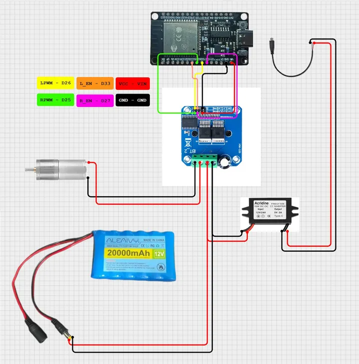
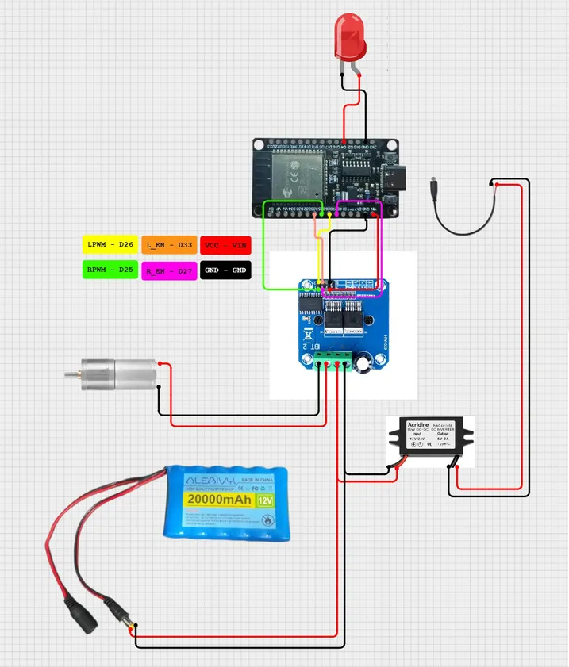
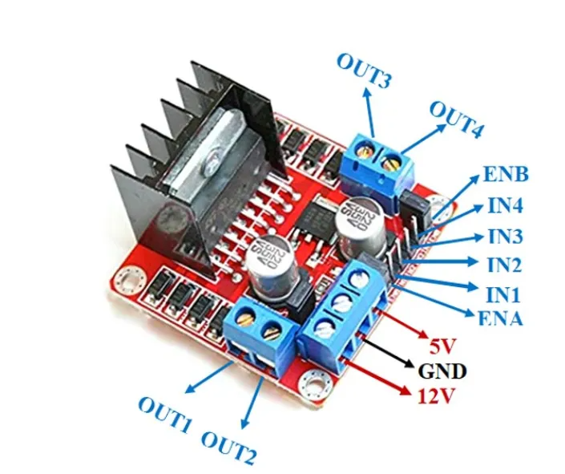
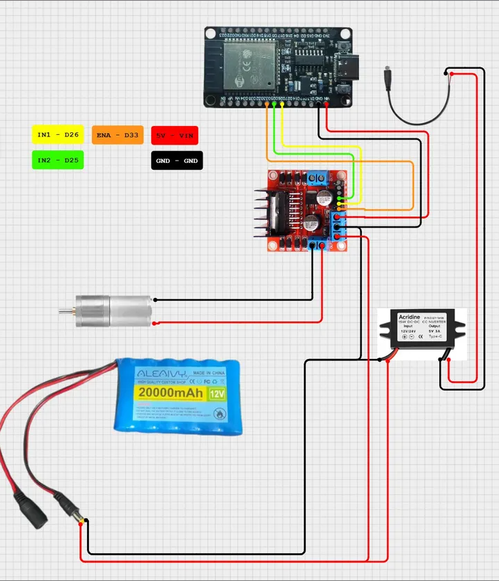

# Bill of Materials

This document lists the hardware used to build the **Poor Man's Throttle** system.

Some parts are required for nearly every build. Others depend on the type of power source, the motor driver you choose, and whether you want optional telemetry or lighting.

---

# Core Components

These are the common core parts for a basic build.

| Component | Description | Possible Buy Location |
|---|---|---|
| ESP32-WROOM-32 USB-C Development Board | Main controller running the PMT firmware | (Cheap Chinese)https://www.amazon.com/dp/B0DNYR973V?ref=ppx_yo2ov_dt_b_fed_asin_title&th=1  Check Ebay as well |
| Motor Driver Board | Drives the locomotive motor from ESP32 control signals | Choose a board that matches one of the supported driver modes below |
| 5V Power Module | Provides stable 5V power for the ESP32 | https://www.amazon.com/dp/B0BNQ5JNWZ?ref=ppx_yo2ov_dt_b_fed_asin_title&th=1 |
| Main Power Source | Powers the motor side of the installation | Battery or DC model railroad transformer |
| Hookup Wire / Power Wire | Required for motor, power, and control wiring | |
| Common Ground Wiring | Required between ESP32 logic side and driver logic side | |

---

# Supported Motor Driver Options

Choose **one** motor driver that matches a supported control style.

| Driver Mode | Typical Wiring Style | Common Example Boards |
|---|---|---|
| DUAL_PWM | Separate forward and reverse PWM paths, often with enable pins | IBT-2, BTS7960 modules, IBT-20, BTN7960/BTS7960 style boards |
| PWM_DIR | One PWM pin plus one direction pin | Cytron MD10C, MD13S, MD30C, MDS40A |
| PWM_BIDIR | One PWM/enable pin plus forward/reverse logic pins | L298N, L293D, TB6612FNG, DRV8871, DRV8876, MC33926, MX1508, SN754410 |
| DUAL_INPT | Two H-bridge inputs with PWM applied on the active side | DRV8833 |

## Recommended Baseline Build

For most first-time builders, the simplest well-documented starting point is still:

| Component | Description |
|---|---|
| ESP32-WROOM-32 USB-C Development Board | Main controller |
| IBT-2 / BTS7960 Motor Driver | Common heavy-duty PMT motor driver choice |
| 5V Power Module | Powers the ESP32 separately from motor power |
| Battery or DC Transformer | Main power source |

---

# Battery Installation Components

These components are used when installing PMT in a battery-powered locomotive.

| Component | Description |
|---|---|
| Battery Pack | Main motor power source |
| Battery Adapter or Battery Connector | Matches the battery style you are using |
| Fuse / Fuse Holder | Recommended protection in the main power path |
| Optional Buck Converter | Used when battery voltage is higher than desired motor voltage |
| Optional Low-Voltage Protection Hardware | Can be external, or partly handled through INA219-based firmware protection if installed |

Supported battery brands include:

* DeWalt  
* Milwaukee  
* Ryobi  
* Rigid  
* other compatible tool batteries  
* other model hobbyist batteries (LiPo, Lithium Ion, NiMH, Lead Acid, Alkaline)

Builders must select a battery adapter that matches their battery brand.

---

# DC Transformer Installation Components

For layouts powered by a DC model railroad transformer.

| Component | Description |
|---|---|
| DC Model Railroad Transformer | Provides motor-side power |
| Fuse / Fuse Holder | Recommended protection |
| Optional Buck Converter | Only needed if voltage reduction is desired |
| ESP32 5V Power Module | Still required for stable controller power |

A battery adapter is **not required** for this installation type.

---

# Optional Firmware-Backed Hardware

These parts are optional and depend on which firmware features you plan to use.

| Component | Description |
|---|---|
| INA219 Current/Voltage Sensor Module | Optional voltage, current, and power telemetry and low-voltage logic |
| I2C Wiring | Required for INA219 SDA/SCL connection |
| Optional Low-Voltage Indicator LED | Can be assigned to indicate low-voltage state |
| LEDs or Other Light Loads | Optional lighting or function outputs |
| LED Resistors (as needed) | Depends on the LED and wiring approach used |
| Additional Hookup Wire | Needed for each accessory output |
| Connectors / Small Terminal Blocks | Helpful for removable wiring |

---

# General Optional Components

These parts are optional for your installation and **not** required.

| Component | Description | Possible Buy Location |
|---|---|---|
| 4-38V Buck Converter 5A | Reduces voltage to match locomotive specs | https://www.amazon.com/dp/B085T73CSD?ref=ppx_yo2ov_dt_b_fed_asin_title |
| 1.2-36V Buck Converter 20A | Reduces voltage to match locomotive specs | https://www.amazon.com/dp/B07R832BRX?ref=ppx_yo2ov_dt_b_fed_asin_title |
| Low Voltage Disconnect | Protects battery from undercharge | https://www.amazon.com/dp/B0C2VMGCZR?ref=ppx_yo2ov_dt_b_fed_asin_title |
| ATC Fuse Holder | Protects wiring and electronics | |
| Blade Fuse (7.5A recommended) | Overcurrent protection | |
| 16AWG Silicone Wire | Main power wiring | |
| 470µF Electrolytic Capacitor | Stabilizes motor power | |
| 220µF Capacitor | Stabilizes 5V supply | |
| Ferrite Core | Reduces electrical noise | |
| Heat Shrink Tubing | Insulation and strain relief | |
| Crimp Connectors / Screw Terminals | Wiring convenience | |
| Mounting Hardware | Board mounting and installation support | |

---

# Example Buck Converter

An adjustable DC-DC buck converter can reduce battery voltage.

Typical example:

20V battery → adjusted to about 15V output.

Any adjustable buck converter capable of handling the required current can be used.  
->https://www.amazon.com/dp/B085T73CSD?ref=ppx_yo2ov_dt_b_fed_asin_title  
->https://www.amazon.com/dp/B07R832BRX?ref=ppx_yo2ov_dt_b_fed_asin_title

---

# Connectors and Hardware

Builders may also need small hardware items.

Examples:

* screw terminals  
* crimp connectors  
* heat shrink tubing  
* mounting hardware

These parts vary depending on the installation style.

---

# Photo Examples

---

# Next Step

Continue to:

This document describes the tools needed and important safety guidelines.

[**04_tools_and_safety.md**](https://github.com/jamocle/PoorMansThrottle-DIY/blob/main/docs/04_tools_and_safety.md)

[<<Back to Home](https://github.com/jamocle/PoorMansThrottle-DIY/blob/main/README.md)

[<< Back to Docs](https://github.com/jamocle/PoorMansThrottle-DIY/tree/main/docs)
