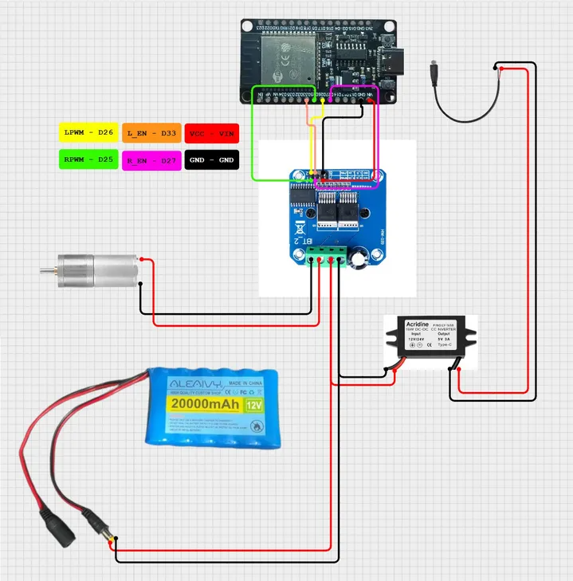
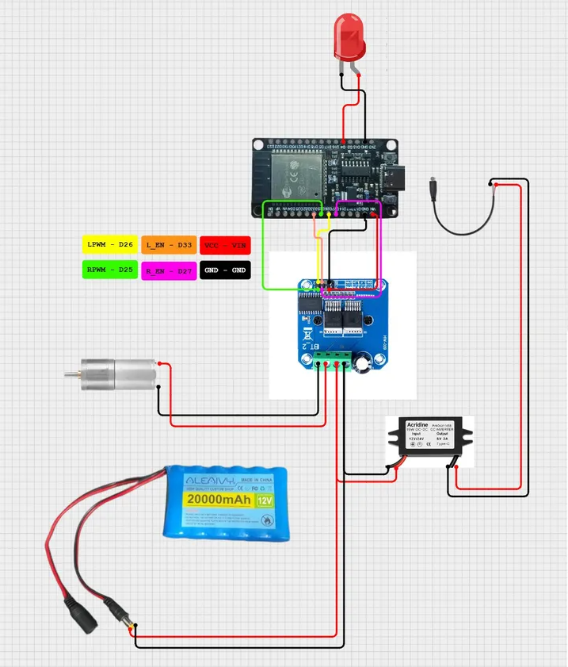
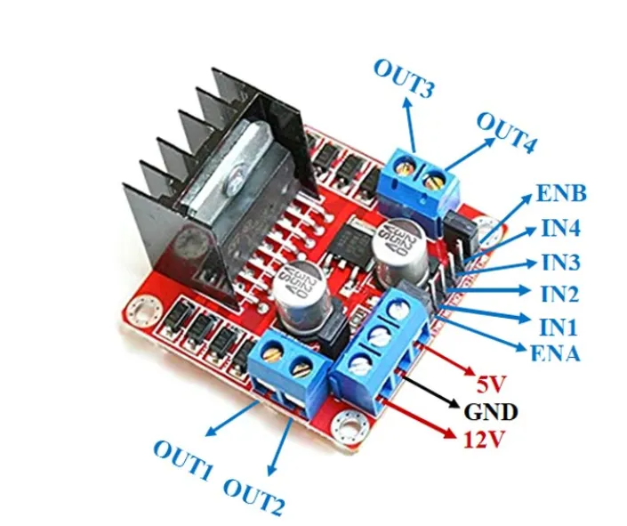
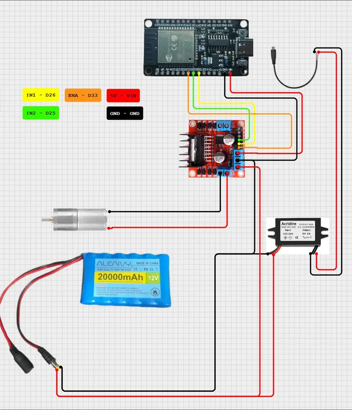

# Bill of Materials

This document lists the hardware commonly used to build **Poor Man's Throttle** devices.

Poor Man's Throttle started as a low-cost wireless locomotive throttle, but the current PMT platform can also support PMT module-style devices and **Poor Man's Turbine** builds. Some parts are required for nearly every build. Others depend on the device type, power source, motor driver, ESC, and optional telemetry or lighting features you choose.

This page is a planning guide, not a wiring diagram. Always verify the ratings of the exact parts you buy before connecting power.

---

# Core Components for Most PMT Builds

These are the common core parts used by most PMT firmware-based devices.

| Component | Description | Possible Buy Location |
|---|---|---|
| ESP32-WROOM-32 USB-C Development Board | Main controller running PMT firmware | https://www.amazon.com/s?k=esp32+wroom&crid=2D5BJCIDJ5EUE&sprefix=esp32+wroom%2Caps%2C199&ref=nb_sb_noss_1 |
| 5V Power Module or Regulator | Provides stable 5V power for the ESP32 | https://www.amazon.com/dp/B0BNQ5JNWZ?ref=ppx_yo2ov_dt_b_fed_asin_title&th=1 |
| Main Power Source | Powers the motor, ESC, accessory, or device-side load | Battery or DC power supply appropriate for the build |
| Hookup Wire / Power Wire | Required for motor, power, signal, and accessory wiring | |
| Common Ground Wiring | Required between the ESP32 logic side and the motor driver, ESC, or accessory logic side | |
| Smartphone or Tablet | Runs the PMT app used for scanning, control, configuration, diagnostics, and supported module screens | iOS or Android device supported by the PMT app |

---

# Choose Your Build Type

The required parts depend on what you are building.

| Build Type | Main Output Hardware | Typical Use |
|---|---|---|
| Poor Man's Throttle | DC motor driver | Wireless locomotive motor control |
| Poor Man's Module | ESP32 plus supported accessory/output hardware | PMT-compatible module-style expansion or custom device control |
| Poor Man's Turbine | ESC or ESC-style PWM-controlled output | Turbine / fan / ESC-style output control from the PMT app |

A single installation should be planned around one firmware/device type at a time.

---

# Poor Man's Throttle Components

These parts are used when building a locomotive throttle controller.

| Component | Description | Required? |
|---|---|---|
| ESP32-WROOM-32 USB-C Development Board | Runs the throttle firmware | Yes |
| Motor Driver Board | Converts ESP32 control signals into locomotive motor power | Yes |
| 5V Power Module | Powers the ESP32 separately from motor power | Yes |
| Battery, DC Transformer, or DC Supply | Provides motor-side power | Yes |
| Fuse / Fuse Holder | Recommended protection in the main motor power path | Strongly recommended |
| Motor Wiring | Connects the motor driver to the locomotive motor | Yes |
| Common Ground | Connects ESP32 logic ground to driver logic ground | Yes |
| Optional Buck Converter | Reduces voltage if the power source is higher than the motor or driver should receive | Optional |
| Optional INA219 Current/Voltage Sensor | Adds battery telemetry and low-voltage behavior when configured | Optional |
| Optional Lighting / Function Output Parts | LEDs, resistors, small loads, or interface hardware for accessories | Optional |

---

# Supported Throttle Motor Driver Options

Choose **one** motor driver that matches a supported control style.

| Driver Mode | Typical Wiring Style | Common Example Boards |
|---|---|---|
| DUAL_PWM | Separate forward and reverse PWM paths, often with enable pins | IBT-2, BTS7960 modules, IBT-20, BTN7960/BTS7960 style boards |
| PWM_DIR | One PWM pin plus one direction pin | Cytron MD10C, MD13S, MD30C, MDS40A |
| PWM_BIDIR | One PWM/enable pin plus forward/reverse logic pins | L298N, L293D, TB6612FNG, DRV8871, DRV8876, MC33926, MX1508, SN754410 |
| DUAL_INPT | Two H-bridge inputs with PWM applied on the active side | DRV8833 |

## Recommended First Throttle Build

For most first-time builders, the simplest well-documented starting point is still:

| Component | Description |
|---|---|
| ESP32-WROOM-32 USB-C Development Board | Main controller |
| IBT-2 / BTS7960 Motor Driver | Common heavy-duty PMT motor driver choice |
| 5V Power Module | Powers the ESP32 separately from motor power |
| Battery or DC Transformer | Main motor-side power source |
| Fuse / Fuse Holder | Recommended protection in the main power path |

---

# Poor Man's Turbine Components

Poor Man's Turbine uses the PMT app and ESP32 firmware to control an ESC-style output instead of a locomotive motor driver.

| Component | Description | Required? |
|---|---|---|
| ESP32-WROOM-32 USB-C Development Board | Runs the turbine firmware | Yes |
| ESC or ESC-Compatible Controller | Receives a standard ESC-style PWM signal from the ESP32 | Yes |
| Turbine, Fan, Motor, or ESC-Driven Load | The device being controlled by the ESC | Yes |
| ESC / Motor Power Source | Battery or supply sized for the ESC and load | Yes |
| Stable 5V Logic Power | Powers the ESP32; may come from a suitable regulator or BEC if appropriate | Yes |
| Common Ground | Required between ESP32 signal ground and ESC ground | Yes |
| Signal Wire | Connects the ESP32 ESC PWM output to the ESC signal input | Yes |
| Fuse / Protection | Recommended in the main power path where appropriate | Strongly recommended |
| Optional INA219 Current/Voltage Sensor | Adds telemetry and low-voltage behavior when configured | Optional |

Turbine builds are different from throttle builds. A throttle motor driver such as an IBT-2 is not the normal output device for Poor Man's Turbine. The turbine firmware is intended for ESC-style output control.

---

# Poor Man's Module Components

Poor Man's Module is the PMT platform path for module-style or custom accessory devices.

| Component | Description | Required? |
|---|---|---|
| ESP32-WROOM-32 USB-C Development Board | Runs the module firmware | Yes |
| 5V Power Module or Regulator | Provides stable power for the ESP32 | Yes |
| Accessory / Output Hardware | Depends on the module being built | As needed |
| LEDs, Resistors, Relays, Drivers, or Interface Boards | Used only if the module design needs them | Optional / build-specific |
| Optional INA219 Current/Voltage Sensor | Adds telemetry and low-voltage reporting when used by the module setup | Optional |
| Enclosure and Connectors | Helpful for permanent or removable module installations | Optional |

Because modules can vary, this section intentionally stays general. Use the specific module documentation for exact output wiring and accessory requirements.

---

# Battery Installation Components

These components are used when installing PMT in a battery-powered locomotive or battery-powered device.

| Component | Description |
|---|---|
| Battery Pack | Main power source |
| Battery Adapter or Battery Connector | Matches the battery style you are using |
| Fuse / Fuse Holder | Recommended protection in the main power path |
| Optional Buck Converter | Used when battery voltage is higher than desired motor, ESC, or electronics voltage |
| Optional Low-Voltage Protection Hardware | Can be external, or partly handled through INA219-based firmware behavior if installed and configured |

Supported battery examples include:

* DeWalt  
* Milwaukee  
* Ryobi  
* Rigid  
* other compatible tool batteries  
* other hobby batteries such as LiPo, lithium-ion, NiMH, sealed lead-acid, or similar packs

Builders must select a battery adapter that matches their battery brand and must verify voltage, current, connector polarity, and battery protection requirements.

---

# DC Transformer Installation Components

For layouts powered by a DC model railroad transformer.

| Component | Description |
|---|---|
| DC Model Railroad Transformer | Provides motor-side power for a throttle installation |
| Fuse / Fuse Holder | Recommended protection |
| Optional Buck Converter | Only needed if voltage reduction is desired |
| ESP32 5V Power Module | Still required for stable controller power |

A battery adapter is **not required** for this installation type.

For DC transformer throttle installations, the transformer is typically used as the steady power source while PMT performs the wireless PWM motor control.

---

# Optional Telemetry and Protection Hardware

These parts are optional and depend on which firmware features you plan to use.

| Component | Description |
|---|---|
| INA219 Current/Voltage Sensor Module | Optional voltage, current, and power telemetry and low-voltage logic |
| I2C Wiring | Required for INA219 SDA/SCL connection |
| Optional Low-Voltage Indicator LED | Can be assigned to indicate low-voltage state |
| Additional Hookup Wire | Needed for telemetry and indicator wiring |
| Connectors / Small Terminal Blocks | Helpful for removable wiring |

INA219 support is optional. A PMT device can run without it, but battery telemetry and firmware-assisted low-voltage behavior require the sensor to be installed and configured.

---

# Optional Lighting and Function Output Hardware

Throttle firmware supports configurable function outputs that can be used for lighting or accessories.

| Component | Description |
|---|---|
| LEDs or Other Light Loads | Optional headlights, reverse lights, FRED-style lights, or accessory outputs |
| LED Resistors | Required for many direct LED wiring approaches |
| Driver Transistor / MOSFET / Relay Module | May be needed when the accessory draws more current than an ESP32 GPIO can safely provide |
| Additional Hookup Wire | Needed for each accessory output |
| Connectors / Small Terminal Blocks | Helpful for serviceable installations |

Do not power high-current accessories directly from ESP32 GPIO pins. Use appropriate driver hardware when the accessory requires more current or voltage than the ESP32 pin can safely handle.

---

# General Optional Components

These parts are optional for your installation and **not** required for every build.

| Component | Description | Possible Buy Location |
|---|---|---|
| 4-38V Buck Converter 5A | Reduces voltage to match locomotive, ESC, or electronics specs | https://www.amazon.com/dp/B085T73CSD?ref=ppx_yo2ov_dt_b_fed_asin_title |
| 1.2-36V Buck Converter 20A | Reduces voltage to match locomotive, ESC, or electronics specs | https://www.amazon.com/dp/B07R832BRX?ref=ppx_yo2ov_dt_b_fed_asin_title |
| Low Voltage Disconnect | External battery under-voltage protection | https://www.amazon.com/dp/B0C2VMGCZR?ref=ppx_yo2ov_dt_b_fed_asin_title |
| ATC Fuse Holder | Protects wiring and electronics | |
| Blade Fuse | Overcurrent protection; size must match the installation | |
| 16AWG Silicone Wire | Main power wiring for many builds | |
| Smaller-Gauge Hookup Wire | Signal and low-current accessory wiring | |
| 470µF Electrolytic Capacitor | Helps stabilize motor-side power in some installations | |
| 220µF Capacitor | Helps stabilize 5V supply in some installations | |
| Ferrite Core | Reduces electrical noise | |
| Heat Shrink Tubing | Insulation and strain relief | |
| Crimp Connectors / Screw Terminals | Wiring convenience | |
| Enclosure / Project Box | Protects electronics in a locomotive, tender, battery car, or external DC installation | |
| Mounting Hardware | Board mounting and installation support | |

---

# Example Buck Converter

An adjustable DC-DC buck converter can reduce battery voltage.

Typical example:

20V battery → adjusted to about 15V output.

Any adjustable buck converter capable of handling the required voltage and current can be used.  
->https://www.amazon.com/dp/B085T73CSD?ref=ppx_yo2ov_dt_b_fed_asin_title  
->https://www.amazon.com/dp/B07R832BRX?ref=ppx_yo2ov_dt_b_fed_asin_title

---

# Connectors and Hardware

Builders may also need small hardware items.

Examples:

* screw terminals  
* crimp connectors  
* heat shrink tubing  
* mounting hardware  
* cable ties or strain relief  
* project box or enclosure

These parts vary depending on the installation style.

---

# Photo Examples

---

# Next Step

Continue to:

This document describes the tools needed and important safety guidelines.

[**04_tools_and_safety.md**](https://github.com/jamocle/PoorMansThrottle-DIY/blob/main/docs/04_tools_and_safety.md)

[<<Back to Home](https://github.com/jamocle/PoorMansThrottle-DIY/blob/main/README.md)

[<< Back to Docs](https://github.com/jamocle/PoorMansThrottle-DIY/tree/main/docs)
