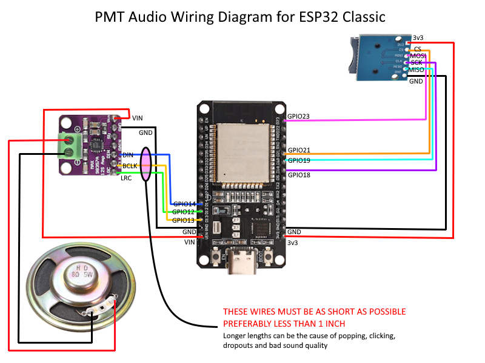
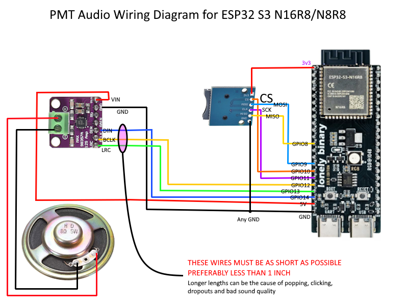
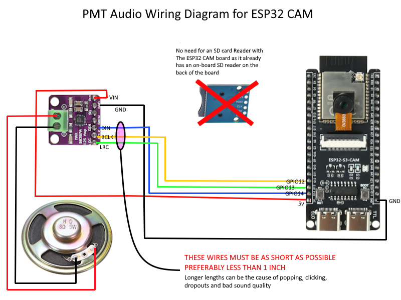

# PMTPlayer Audio Installation Guide
## Classic ESP32, ESP32-S3 N16R8, and ESP32-S3 CAM N16R8

**For PMT firmware 3.0.0**

This guide is written for installers. Use the section for your board and wire it exactly as shown.

## Bill of Materials

For the **ESP32-S3-N16R8** audio installation:

- **ESP32-S3-N16R8**
- **WWZMDiB Micro SD TF Card Adapter Mini Reader Module 3.3V 6 Pin SPI Interface** (or equivalent)
- **AITRIP 3 PCS MAX98357 Audio Power Amplifier Module I2S Class D Filterless Audio Amplifiers Board**
- **4/8 ohm 4-watt speaker**
- **Small microSD card — 128 MB is just fine (yes, megabyte, not gigabyte)**

---

# 1. Identify Your Board

There are three different PMTPlayer audio installations.

| Board | microSD card |
|---|---|
| **Classic ESP32-WROOM-32 / WROOM-32E** | External microSD reader required |
| **ESP32-S3 N16R8 — Standard** | External microSD reader required |
| **ESP32-S3 CAM N16R8** | Uses the onboard microSD slot |

**Do not use the Standard S3 microSD wiring on an S3 CAM when using the CAM's onboard card slot.**

> GPIO numbers in this guide are the ESP32 GPIO numbers. Do not count connector pins from one end of the board.

---

# 2. MAX98357A Amplifier — Important

All three board types use a MAX98357A amplifier.

The three signal wires are:

- **BCLK**
- **LRCLK / WS / LRC**
- **DIN**

**BCLK, LRCLK/WS, and DIN MUST be as short as possible. Preferably about 1 inch or less each.**

**MAX98357A power:** The amplifier supports approximately 3V to 5V. For PMT installation, connect VIN/VCC to the highest suitable power output available on the ESP32 board, typically **5V**.

Long or messy wiring on these three lines can cause clicking, popping, stuttering, or uneven sound.

Also:

- connect MAX98357A **GND** to ESP32 **GND**
- use a clean, direct ground wire for the amplifier
- keep the amplifier ground return separate from the SD-card ground path until they meet at the ESP32 ground
- connect the speaker only to the MAX98357A speaker `+` and `-` outputs
- **do not connect either speaker wire to ESP32 GND**
- the MAX98357A supports approximately 3V to 5V power; connect it to the highest suitable supply available on the ESP32 board, typically **5V**

---

# 3. Classic ESP32-WROOM-32 / WROOM-32E

Use this section only for the **Classic ESP32**.

You need:

- Classic ESP32
- external microSD reader
- MAX98357A amplifier
- speaker

## microSD wiring

| microSD reader | Classic ESP32 |
|---|---:|
| CS | **GPIO21** |
| SCK / CLK | **GPIO18** |
| MISO / DO | **GPIO19** |
| MOSI / DI | **GPIO23** |
| GND | **GND** |
| VCC | Use the voltage required by your exact microSD reader (likely 3.3V) |

## MAX98357A wiring

| MAX98357A | Classic ESP32 |
|---|---:|
| BCLK | **GPIO13** |
| LRCLK / WS / LRC | **GPIO12** |
| DIN | **GPIO14** |
| GND | **GND** |
| VIN / VCC | **Use the highest suitable ESP32 supply available, typically 5V** |

**BCLK, LRCLK/WS, and DIN MUST be as short as possible. Preferably about 1 inch or less each.**

## Speaker

| MAX98357A | Speaker |
|---|---|
| Speaker + | Speaker wire 1 |
| Speaker - | Speaker wire 2 |

**Do not connect either speaker wire to ESP32 GND.**

## ESP32 Classic Wiring Diagram


## Classic quick check

Before power-on:

- [ ] SD CS -> GPIO21
- [ ] SD SCK -> GPIO18
- [ ] SD MISO -> GPIO19
- [ ] SD MOSI -> GPIO23
- [ ] MAX98357A BCLK -> GPIO13
- [ ] MAX98357A LRCLK/WS -> GPIO12
- [ ] MAX98357A DIN -> GPIO14
- [ ] **BCLK, LRCLK/WS, and DIN are about 1 inch or less if possible**
- [ ] SD reader and amplifier both have GND connected
- [ ] amplifier has a clean ground connection to ESP32 GND
- [ ] speaker is connected only to the amplifier outputs
- [ ] microSD card is formatted as required in Section 6 and inserted

---

# 4. ESP32-S3 N16R8 — Standard Board

Use this section for the **standard ESP32-S3 N16R8** that uses an **external microSD reader**.

You need:

- ESP32-S3 N16R8
- external microSD reader
- MAX98357A amplifier
- speaker

## microSD wiring

| microSD reader | Standard ESP32-S3 |
|---|---:|
| CS | **GPIO10** |
| SCK / CLK | **GPIO11** |
| MISO / DO | **GPIO8** |
| MOSI / DI | **GPIO9** |
| GND | **GND** |
| VCC | Use the voltage required by your exact microSD reader (likely 3.3V) |

## MAX98357A wiring

| MAX98357A | Standard ESP32-S3 |
|---|---:|
| BCLK | **GPIO12** |
| LRCLK / WS / LRC | **GPIO13** |
| DIN | **GPIO14** |
| GND | **GND** |
| VIN / VCC | **Use the highest suitable ESP32 supply available, typically 5V** |

**BCLK, LRCLK/WS, and DIN MUST be as short as possible. Preferably about 1 inch or less each.**

## Speaker

| MAX98357A | Speaker |
|---|---|
| Speaker + | Speaker wire 1 |
| Speaker - | Speaker wire 2 |

**Do not connect either speaker wire to ESP32 GND.**

## ESP32 S3 Wiring Diagram


## Standard S3 quick check

Before power-on:

- [ ] SD CS -> GPIO10
- [ ] SD SCK -> GPIO11
- [ ] SD MISO -> GPIO8
- [ ] SD MOSI -> GPIO9
- [ ] MAX98357A BCLK -> GPIO12
- [ ] MAX98357A LRCLK/WS -> GPIO13
- [ ] MAX98357A DIN -> GPIO14
- [ ] **BCLK, LRCLK/WS, and DIN are about 1 inch or less if possible**
- [ ] SD reader and amplifier both have GND connected
- [ ] amplifier has a clean ground connection to ESP32-S3 GND
- [ ] speaker is connected only to the amplifier outputs
- [ ] microSD card is formatted as required in Section 6 and inserted

---

# 5. ESP32-S3 CAM N16R8

Use this section for the **ESP32-S3 CAM N16R8 with the onboard microSD slot**.

You need:

- ESP32-S3 CAM N16R8
- MAX98357A amplifier
- speaker

**You do not need an external microSD reader.**

The onboard microSD slot is already connected to the ESP32-S3.

For reference, the onboard card uses:

- GPIO39
- GPIO38
- GPIO40

**Do not add wires to these pins for the onboard microSD card.**

## MAX98357A wiring

| MAX98357A | ESP32-S3 CAM |
|---|---:|
| BCLK | **GPIO12** |
| LRCLK / WS / LRC | **GPIO13** |
| DIN | **GPIO14** |
| GND | **GND** |
| VIN / VCC | **Use the highest suitable ESP32 supply available, typically 5V** |

**BCLK, LRCLK/WS, and DIN MUST be as short as possible. Preferably about 1 inch or less each.**

## Speaker

| MAX98357A | Speaker |
|---|---|
| Speaker + | Speaker wire 1 |
| Speaker - | Speaker wire 2 |

**Do not connect either speaker wire to ESP32 GND.**

## ESP32 CAM Wiring Diagram


## S3 CAM quick check

Before power-on:

- [ ] microSD card is inserted in the onboard slot
- [ ] no external SD reader is connected for normal CAM use
- [ ] MAX98357A BCLK -> GPIO12
- [ ] MAX98357A LRCLK/WS -> GPIO13
- [ ] MAX98357A DIN -> GPIO14
- [ ] **BCLK, LRCLK/WS, and DIN are about 1 inch or less if possible**
- [ ] amplifier GND is connected to ESP32-S3 GND
- [ ] amplifier has a clean ground connection
- [ ] speaker is connected only to the amplifier outputs
- [ ] microSD card is formatted as required in Section 6

---

# 6. Get PMTPlayer Sounds

PMTPlayer sounds can be downloaded here:

https://jamocle.github.io/PoorMansThrottle-DIY/Installer/home.html

Sounds can also be uploaded there to contribute to the crowdsourced PMTPlayer sound collection.

## microSD card format requirement

**The microSD card must use the format shown below. Do not use exFAT.**

| Card size | Format to use |
|---:|---|
| 128 MB | **FAT16** |
| 256 MB | **FAT16** |
| 512 MB | **FAT16** |
| 1 GB | **FAT16** |
| 2 GB | **FAT16** |
| 4 GB | **FAT32** |
| 8 GB | **FAT32** |
| 16 GB | **FAT32** |
| 32 GB | **FAT32** |
| 64 GB | **FAT32 — reformat if the card came as exFAT** |
| 128 GB | **FAT32 — reformat if the card came as exFAT** |

**64 GB and 128 GB cards are often sold already formatted as exFAT. PMTPlayer requires them to be reformatted as FAT32 before use.**

On an S3 board, a card that cannot be mounted or used during audio startup can cause **5 red flashes**.

Use:

- Diesel sounds for PMTPlayer Diesel
- Steam sounds for PMTPlayer Steam

Copy the wav files you downloaded or created to your SD card. The firmware looks for files in the diesel or steam folders on the SD card. e.g.:

```text
/diesel/####.wav
```

or:

```text
/steam/####.wav
```

Example:

```text
/diesel/0001.wav
/steam/0001.wav
```

If you create your own WAV files, use:

- mono
- 16-bit PCM
- 8 kHz to 48 kHz sample rate

---

# 7. First Power-On

After all wiring is complete:

1. Insert the prepared microSD card. Make sure it is formatted as shown in **Section 6**. **Do not use exFAT.**
2. Check the wiring against the correct board section one more time.
3. Make sure the three amplifier signal wires are very short.
4. Power on the ESP32.
5. Enable audio if it is currently disabled.
6. Select Diesel or Steam as required.
7. Test a sound.

The firmware defaults to **audio disabled**, so a correctly wired installation can still be silent until audio is enabled.

## S3 boards: red LED flashes at startup

**This applies only to the ESP32-S3 Standard and ESP32-S3 CAM boards. It does not apply to the Classic ESP32.**

If the red LED flashes, pauses, and repeats, **count the flashes**:

- **4 flashes** — one or more sound files could not be loaded.
- **5 flashes** — the audio system could not start.
- **6 flashes** — audio file information could not be saved to the SD card.

**Important:** A missing individual WAV file normally causes **4 flashes**, not 5.  
**5 flashes can happen when the SD card itself cannot be used**, including when a 64 GB or 128 GB card is still formatted as exFAT instead of FAT32.

For causes and fixes, see **Section 8 — S3 startup red LED error codes**.

The basic commands are:

### Diesel

```text
CV400=0
CV401=2
CV400=1
```

### Steam

```text
CV400=0
CV401=3
CV400=1
```

---

# 8. Troubleshooting

## S3 startup red LED error codes

**This section is only for ESP32-S3 Standard and ESP32-S3 CAM boards.**

The red LED flashes the error number, pauses, and repeats. The code stays active until the board is rebooted.

### 4 red flashes — one or more sound files did not load

**What it means:**  
The SD card is working, but one or more required sound files could not be loaded.

**Common causes:**

- a required WAV file is missing
- a WAV file is damaged or is not in a supported format
- the SD card could not read part of a file
- a sound file is too large for the available audio memory
- the board did not have enough memory to load the sound

**What to do:**

1. Make sure the correct `/diesel` or `/steam` folder is on the SD card.
2. Make sure the required WAV files are present.
3. Make sure the WAV files use the format listed in this guide.
4. Check the SD card and its connections.
5. Fix the problem, then reboot the board.

**The board may still play sound with 4 flashes.** Files that could not be preloaded can use the SD card directly.

### 5 red flashes — the audio system could not start

**What it means:**  
The audio system did not finish starting.

**Common causes:**

- the SD card itself cannot be detected or used
- the SD card is formatted incorrectly
- a 64 GB or 128 GB card is still formatted as exFAT instead of FAT32
- SD or audio pins are set incorrectly
- BCLK, LRCLK/WS, or DIN wiring is wrong
- the audio output could not start
- the board did not have enough memory or another required audio task could not start

**What to do:**

1. Check the card format against the table in **Section 6**.
   - **128 MB through 2 GB:** use FAT16.
   - **4 GB through 128 GB:** use FAT32.
   - **Do not use exFAT.**
2. Check the SD card itself.
   - **Standard S3:** check the external SD card reader and its wiring.
   - **S3 CAM:** make sure the card is fully inserted in the onboard SD slot.
3. Check BCLK, LRCLK/WS, and DIN against the wiring table for your board.
4. If you changed CV403 through CV409, make sure those settings match your actual wiring.
5. Fix the problem, then reboot the board.
6. If 5 flashes still return, check the startup serial log for the exact failure.

**Important:** A missing individual WAV file normally causes **4 flashes**, not 5.  
**5 flashes can happen when the SD card itself cannot be used, including when a 64 GB or 128 GB card is formatted as exFAT instead of FAT32.**

### 6 red flashes — audio file information could not be saved

**What it means:**  
The board read and checked the WAV file, but it could not save the generated `.csh` information back to the SD card.

**Common causes:**

- the SD card became unavailable
- the card or file path could not be used
- the firmware could not open the `.csh` file for writing
- the write to the SD card did not finish correctly

**What to do:**

1. Make sure the SD card is still inserted and working.
2. Make sure the card uses the format listed in **Section 6** and can be written to.
3. Check the SD card and its connections.
4. Fix the problem, then reboot the board.
5. If 6 flashes return, check the serial log for the exact save failure.

**The board may still play sound with 6 flashes.** The audio information already held in memory can still be used for that boot.

## No sound

**On an S3 board, if the red LED is flashing a repeating code, check the S3 startup red LED error codes above first.**

Check:

1. Audio is enabled.
2. Diesel or Steam is selected.
3. You used the wiring table for the correct board.
4. MAX98357A BCLK, LRCLK/WS, and DIN are on the correct GPIOs.
5. MAX98357A has power and ground.
6. Speaker is connected to the amplifier `+` and `-` outputs.
7. The microSD card is inserted.
8. The microSD card uses the format listed in **Section 6**. **Do not use exFAT.**
9. The correct `/diesel` or `/steam` folder exists.

## Clicking, popping, stuttering, or uneven sound

**First check the three amplifier signal wires: BCLK, LRCLK/WS, and DIN. They MUST be as short as possible, preferably about 1 inch or less.**

Then:

1. Connect the MAX98357A ground directly back to ESP32 GND.
2. Do not run amplifier ground through the same long breadboard ground path as the SD reader.
3. Move the three signal wires away from motor, PWM, ESC, and other high-current wiring.
4. Check for loose jumper wires or breadboard contacts.

## Standard S3 external microSD not detected

Check:

| Signal | GPIO |
|---|---:|
| CS | 10 |
| SCK | 11 |
| MISO | 8 |
| MOSI | 9 |

Also check card insertion, power, ground, loose connections, and the card format in **Section 6**. **Do not use exFAT.**

## Classic external microSD not detected

Check:

| Signal | GPIO |
|---|---:|
| CS | 21 |
| SCK | 18 |
| MISO | 19 |
| MOSI | 23 |

Also check card insertion, power, ground, loose connections, and the card format in **Section 6**. **Do not use exFAT.**

## S3 CAM onboard microSD not detected

Check:

- card is fully inserted in the onboard slot
- the card uses the format listed in **Section 6**; **do not use exFAT**
- you are using the S3 CAM section, not the Standard S3 external-SD wiring
- nothing else is using GPIO39, GPIO38, or GPIO40
- the card is prepared correctly

## Boot chime but downloaded sounds do not play

Check:

- correct Diesel or Steam folder
- sound files are present
- filenames use four digits such as `0001.wav`
- the microSD card is being detected
- the microSD card uses the format listed in **Section 6**; **do not use exFAT**

On S3 boards, the boot chime can work even when the SD card or sound files have a problem.

---

# 9. Advanced Configuration
## Only use this section if you need to change the default audio wiring or settings

Most installations should use the default wiring tables above and leave these values alone.

## Audio settings

| CV | Setting |
|---:|---|
| CV400 | Audio enable: `0` off, `1` on |
| CV401 | `2` Diesel, `3` Steam |
| CV402 | Master volume; default `15` |

## Classic ESP32 defaults

| CV | Function | Default physical GPIO |
|---:|---|---:|
| CV403 | SD CS | GPIO21 |
| CV404 | SD SCK | GPIO18 |
| CV405 | SD MISO | GPIO19 |
| CV406 | SD MOSI | GPIO23 |
| CV407 | BCLK | GPIO13 |
| CV408 | LRCLK / WS | GPIO12 |
| CV409 | DIN | GPIO14 |

On Classic ESP32, CV404, CV405, and CV406 may display `-1`. **That is normal.** With the standard Classic ESP32 setup, the actual physical pins are still:

- SCK -> GPIO18
- MISO -> GPIO19
- MOSI -> GPIO23

## Standard ESP32-S3 defaults

| CV | Function | Default GPIO |
|---:|---|---:|
| CV403 | SD CS | GPIO10 |
| CV404 | SD SCK | GPIO11 |
| CV405 | SD MISO | GPIO8 |
| CV406 | SD MOSI | GPIO9 |
| CV407 | BCLK | GPIO12 |
| CV408 | LRCLK / WS | GPIO13 |
| CV409 | DIN | GPIO14 |

## ESP32-S3 CAM onboard microSD

For normal CAM use, the onboard microSD card is already wired internally.

If you need to explicitly force the firmware to use the onboard card reader, use:

```text
CV400=0
CV401=2
CV403=-1
CV404=-1
CV405=-1
CV406=-1
CV407=12
CV408=13
CV409=14
CV400=1
```

Use `CV401=3` instead of `CV401=2` for Steam.

## Changing custom GPIOs

If you intentionally use different pins:

1. turn audio off
2. select Diesel or Steam
3. change CV403 through CV409 as needed
4. turn audio back on

Example order:

```text
CV400=0
CV401=2
# Change only the GPIO CVs you intentionally rewired
CV400=1
```

---

# 10. One-Page Wiring Reference

## Classic ESP32

```text
microSD
CS    -> GPIO21
SCK   -> GPIO18
MISO  -> GPIO19
MOSI  -> GPIO23

MAX98357A
BCLK  -> GPIO13
LRCLK -> GPIO12
DIN   -> GPIO14
```

## Standard ESP32-S3 N16R8

```text
microSD
CS    -> GPIO10
SCK   -> GPIO11
MISO  -> GPIO8
MOSI  -> GPIO9

MAX98357A
BCLK  -> GPIO12
LRCLK -> GPIO13
DIN   -> GPIO14
```

## ESP32-S3 CAM N16R8

```text
microSD
Use the onboard card slot.
No external SD wiring is required.

MAX98357A
BCLK  -> GPIO12
LRCLK -> GPIO13
DIN   -> GPIO14
```

**For every board: BCLK, LRCLK/WS, and DIN MUST be as short as possible. Preferably about 1 inch or less each.**
