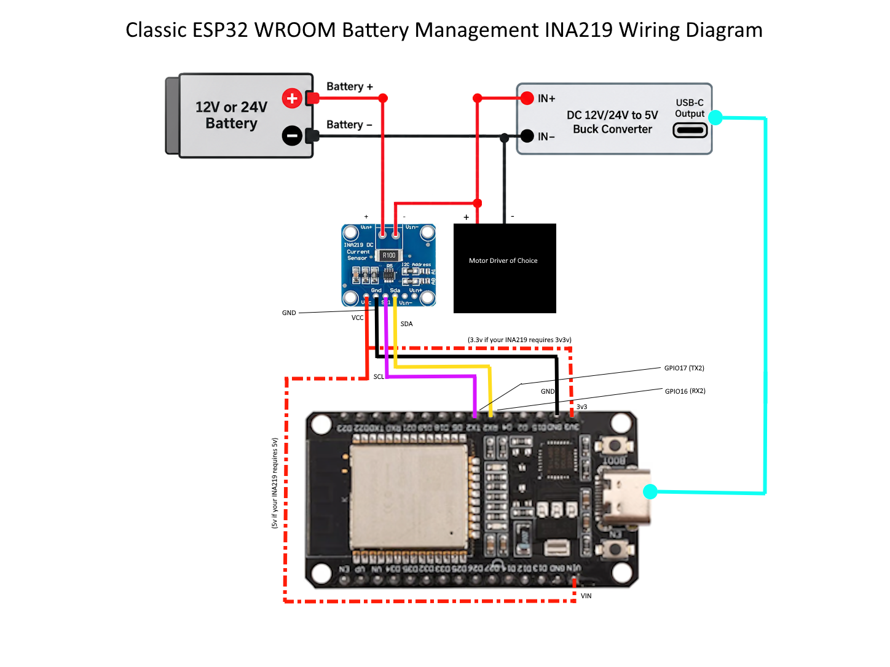
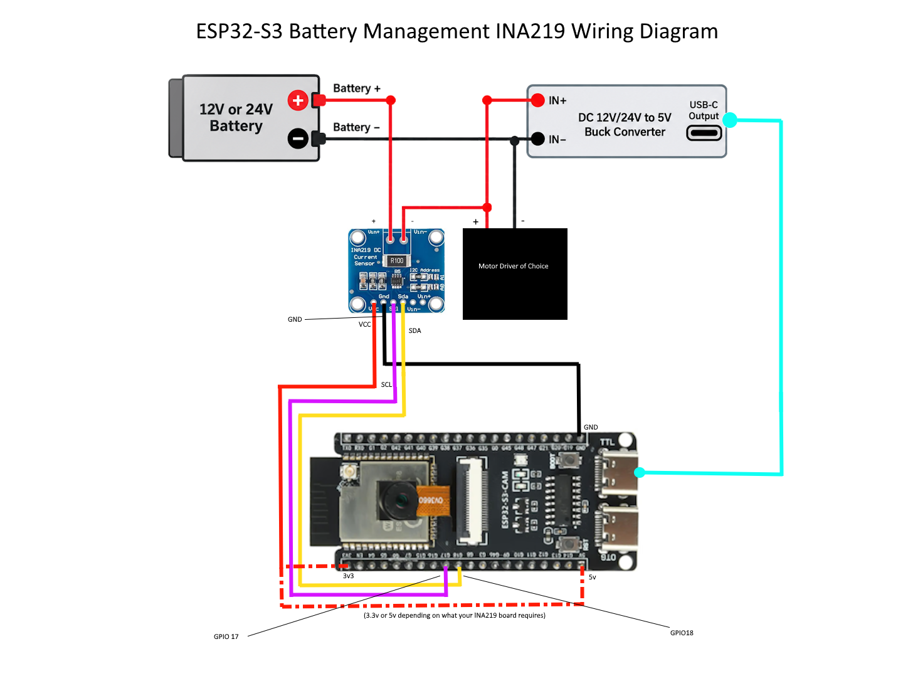

# PMT INA219 Battery Monitor Add-On Installation Guide
## Classic ESP32 and ESP32-S3

**For PMT firmware 3.3.2**

This guide documents the INA219 battery-monitor add-on for an existing PMT throttle installation.

---

# 1. What the INA219 Add-On Does

The INA219 adds battery-side monitoring to the PMT throttle.

PMT uses it to read:

- battery/bus voltage
- current
- power
- highest bus voltage observed since the INA219 runtime was initialized
- low-voltage warning state
- throttle-limit state
- shutdown state
- battery-disconnect state

The INA219 can also be used by PMT to:

- warn when battery voltage falls below a configured level
- cap throttle when battery voltage falls below a configured level
- stop the motor when battery voltage falls below a configured level
- detect a disconnected or nearly-zero-voltage battery
- drive an optional low-voltage/status LED

The INA219 feature is **disabled by default**.

To enable it:

```text
CV30=1
```

You can also enable INA219 monitoring directly in the app under **Configuration > Battery Management**.

---

# 2. Bill of Materials

For a typical PMT installation with battery monitoring:

- **Classic ESP32-WROOM-32 / WROOM-32E** or **ESP32-S3**
- **INA219 current/voltage monitor breakout**
- the existing PMT installation and battery power wiring
- I2C wiring for INA219 SDA/SCL
- optional external LED and current-limiting resistor if CV42 is used; CV42 can also be configured under **Configuration > Battery Management** in the app

The INA219 is added to the **battery positive supply path** so PMT can monitor the battery feeding the existing installation.

---

# 3. Identify Your Board

PMT uses different default INA219 I2C pins for the Classic ESP32 and ESP32-S3.

| Board | INA219 SDA | INA219 SCL | I2C Address |
|---|---:|---:|---:|
| **Classic ESP32-WROOM-32 / WROOM-32E** | **GPIO16** | **GPIO17** | **64 decimal / 0x40** |
| **ESP32-S3** | **GPIO17** | **GPIO18** | **64 decimal / 0x40** |

These pins are controlled by:

- `CV31` = INA219 SDA GPIO
- `CV32` = INA219 SCL GPIO
- `CV33` = INA219 I2C address

CV31 and CV32 can also be configured directly in the app under **Configuration > Battery Management**.

## INA219 default GPIO reference

| Function | Classic ESP32 | ESP32-S3 |
|---|---:|---:|
| INA219 SDA | **GPIO16** | **GPIO17** |
| INA219 SCL | **GPIO17** | **GPIO18** |
| INA219 low-voltage LED | Disabled | Disabled |

# 4. Battery Current Path — Read This First

For battery monitoring, the INA219 must be placed in series with the battery positive supply.

Treat the existing PMT installation as a black box. The INA219 sits between **Battery +** and the existing installation's positive power input.

```text
Battery +
   |
   v
INA219 VIN+
   |
   |  internal INA219 shunt
   v
INA219 VIN-
   |
   v
Existing PMT installation / positive power input
```

Battery negative remains connected to the existing PMT installation as it already is, and INA219 GND joins that same common ground:

```text
Battery -
   +------------------> Existing PMT installation / ground
   |
   +------------------> INA219 GND
```

With the INA219 installed before the existing installation's positive input, the sensor measures the current flowing from the battery into the monitored PMT system.

**Do not create a second Battery + path that bypasses the INA219 for any load you want included in the current/power measurement.**

The INA219 is a battery-supply monitor. It does not require changes inside the existing PMT installation.

# 5. INA219 Logic Connections

The INA219 also needs its I2C logic connections.

## Classic ESP32

| INA219 | Classic ESP32 |
|---|---:|
| **SDA** | **GPIO16** |
| **SCL** | **GPIO17** |
| **GND** | **Common ground** |
| **VCC** | See hardware note below |

## ESP32-S3

| INA219 | ESP32-S3 |
|---|---:|
| **SDA** | **GPIO17** |
| **SCL** | **GPIO18** |
| **GND** | **Common ground** |
| **VCC** | See hardware note below |

## Important INA219 VCC note

The INA219 module's `VCC` pin powers the breakout board's logic circuitry. The correct VCC connection depends on the exact INA219 breakout board being used.

Before connecting `VCC`, check the specifications for your module and connect it only to a supply voltage that the module supports.

For ESP32 installations, also make sure the breakout board's I2C pull-ups do not pull `SDA` or `SCL` above the ESP32's 3.3V GPIO level.

Do not assume that every INA219 breakout board uses the same VCC arrangement.

---

# 6. Grounds MUST Be Common

The INA219 logic ground must share the same electrical reference as the ESP32.

Connect:

```text
Battery -
   +--> Existing PMT installation / common ground
   +--> INA219 GND
```

The existing PMT power system already establishes the ESP32 ground reference. INA219 GND must join that same common ground.

**If the INA219 and ESP32 do not share a common ground reference, I2C communication may be unreliable or fail completely.**

# 7. Classic ESP32 Wiring

## INA219 to Classic ESP32

| INA219 connection | Classic ESP32 / system |
|---|---|
| **VIN+** | Battery + |
| **VIN-** | Existing PMT installation positive power input |
| **GND** | Common ground |
| **SDA** | **GPIO16** |
| **SCL** | **GPIO17** |
| **VCC** | Connect to the supply voltage specified for your INA219 breakout board |

## Classic Wiring Diagram



## Classic quick check

- [ ] Battery + enters INA219 VIN+
- [ ] INA219 VIN- feeds the existing PMT installation positive power input
- [ ] No monitored Battery + load bypasses the INA219
- [ ] INA219 GND connects to common ground
- [ ] INA219 SDA -> GPIO16
- [ ] INA219 SCL -> GPIO17
- [ ] INA219 VCC matches the requirements of the exact breakout
- [ ] Existing PMT wiring remains otherwise unchanged
- [ ] INA219 monitoring enabled with `CV30=1`, or enabled under **Configuration > Battery Management** in the app, after wiring is checked

# 8. ESP32-S3 Wiring

## INA219 to ESP32-S3

| INA219 connection | ESP32-S3 / system |
|---|---|
| **VIN+** | Battery + |
| **VIN-** | Existing PMT installation positive power input |
| **GND** | Common ground |
| **SDA** | **GPIO17** |
| **SCL** | **GPIO18** |
| **VCC** | Connect to the supply voltage specified for your INA219 breakout board |

## ESP32-S3 Wiring Diagram



## ESP32-S3 quick check

- [ ] Battery + enters INA219 VIN+
- [ ] INA219 VIN- feeds the existing PMT installation positive power input
- [ ] No monitored Battery + load bypasses the INA219
- [ ] INA219 GND connects to common ground
- [ ] INA219 SDA -> GPIO17
- [ ] INA219 SCL -> GPIO18
- [ ] INA219 VCC matches the requirements of the exact breakout
- [ ] Existing PMT wiring remains otherwise unchanged
- [ ] INA219 monitoring enabled with `CV30=1`, or enabled under **Configuration > Battery Management** in the app, after wiring is checked

# 9. Recommended Wiring Order

1. Disconnect the battery.
2. Leave the existing PMT installation wiring otherwise unchanged.
3. Connect INA219 GND to the existing common ground.
4. Connect INA219 SDA and SCL using the table for your ESP32.
5. Connect INA219 VCC according to the requirements of the exact INA219 breakout.
6. Disconnect the existing PMT positive power input from Battery +.
7. Connect Battery + to INA219 VIN+.
8. Connect INA219 VIN- to the existing PMT positive power input.
9. Recheck that no Battery + path bypasses the INA219 for any load you want included in the measurement.
10. Reconnect the battery.
11. Confirm the ESP32 starts normally.
12. Enable the INA219 with:

```text
CV30=1
```

   Or enable it directly in the app under **Configuration > Battery Management**.

13. Verify telemetry before configuring any low-voltage protection thresholds.
14. Test the system at low throttle first.

# 10. First INA219 Test

The safest first test is to enable monitoring while leaving the low-voltage warning, throttle-limit, and shutdown thresholds disabled.

The firmware defaults already do this.

Factory protection defaults:

```text
CV36=0
CV37=0
CV38=0
CV39=0
CV40=1000
CV41=25
CV42=0
```

CV36, CV37, CV38, CV40, CV41, and CV42 can also be configured directly in the app under **Configuration > Battery Management**.

Enable the sensor:

```text
CV30=1
```

You can also enable it directly under **Configuration > Battery Management** in the app.

Then confirm that PMT reports sensible voltage/current/power telemetry.

Do not configure shutdown thresholds until you have confirmed:

- the INA219 is detected
- bus voltage is plausible
- current changes when the motor load changes
- the current/power readings are appropriate for your INA219 hardware
- SDA/SCL are stable
- the ESP32 does not reset when the motor starts

---

# 11. INA219 CV Quick Reference

The following INA219 settings can also be configured directly in the app under **Configuration > Battery Management**:

```text
CV30
CV31
CV32
CV36
CV37
CV38
CV40
CV41
CV42
```

You can use the app's Battery Management section instead of entering these CV values manually.

| CV | Purpose | Classic Default | ESP32-S3 Default | App: Configuration > Battery Management | Allowed / Important Behavior |
|---:|---|---:|---:|---|---|
| **CV30** | INA219 enable | `0` | `0` | **Yes** | `0` disabled, `1` enabled |
| **CV31** | INA219 SDA GPIO | `16` | `17` | **Yes** | Required valid runtime GPIO |
| **CV32** | INA219 SCL GPIO | `17` | `18` | **Yes** | Required valid runtime GPIO |
| **CV33** | INA219 I2C address | `64` | `64` | — | Decimal `64..79` = `0x40..0x4F` |
| **CV34** | Sample interval | `500` ms | `500` ms | — | `50..60000` ms |
| **CV35** | Publish interval | `10000` ms | `10000` ms | — | `100..60000` ms |
| **CV36** | Low-voltage warning threshold | `0` mV | `0` mV | **Yes** | `0` disables warning |
| **CV37** | Throttle-limit threshold | `0` mV | `0` mV | **Yes** | `0` disables throttle limiting |
| **CV38** | Shutdown threshold | `0` mV | `0` mV | **Yes** | `0` disables low-voltage shutdown |
| **CV39** | Recovery threshold | `0` mV | `0` mV | — | `0` means no voltage-driven automatic recovery condition |
| **CV40** | Battery-disconnect threshold | `1000` mV | `1000` mV | **Yes** | `0` disables disconnect detection |
| **CV41** | Throttle cap while limited | `25` % | `25` % | **Yes** | `0..100` % |
| **CV42** | Low-voltage/status LED GPIO | `0` | `0` | **Yes** | `0` disables optional LED |

Voltage thresholds are stored in **millivolts**.

Examples:

```text
12000 mV = 12.0 V
18000 mV = 18.0 V
24000 mV = 24.0 V
```

Do not copy example voltages as battery-protection recommendations. Select thresholds for the battery chemistry, series-cell count, load, and operating requirements of your installation.

---

# 12. CV30 — Enable INA219 Monitoring

**App configuration:** CV30 can also be configured directly under **Configuration > Battery Management** in the app.

```text
CV30=0
```

INA219 monitoring disabled.

```text
CV30=1
```

INA219 monitoring enabled.

Factory default:

```text
CV30=0
```

When enabled, PMT attempts to initialize the I2C bus using CV31/CV32, probe the address in CV33, program the INA219 configuration/calibration, and begin sampling.

If initialization or a later register read fails, PMT marks the INA219 data invalid and retries setup periodically.

The firmware retries an unconfigured INA219 approximately once per second.

---

# 13. CV31 and CV32 — I2C GPIOs

**App configuration:** CV31 and CV32 can also be configured directly under **Configuration > Battery Management** in the app.

## Classic ESP32 defaults

```text
CV31=16
CV32=17
```

## ESP32-S3 defaults

```text
CV31=17
CV32=18
```

CV31 is SDA.

CV32 is SCL.

These are **required bus pins**. Unlike optional output-pin CVs, `0` is not treated as an "off" value for the INA219 bus.

PMT validates these pins against its board-specific runtime GPIO policy.

The firmware also prevents SDA and SCL from being configured to the same GPIO.

If CV42 is enabled, the low-voltage LED GPIO also cannot be the same pin as INA219 SDA or SCL.

Only change CV31/CV32 if the INA219 is physically wired to different GPIOs.

---

# 14. CV33 — INA219 I2C Address

Factory default:

```text
CV33=64
```

PMT stores and reports the address in **decimal**.

The default decimal address `64` is:

```text
0x40
```

Supported range:

```text
64..79 decimal
```

Equivalent hexadecimal range:

```text
0x40..0x4F
```

If your INA219 breakout uses address-selection pads or jumpers, change CV33 to match the address actually configured on the hardware.

Changing CV33 causes PMT to re-run INA219 setup.

---

# 15. CV34 — Sample Interval

Factory default:

```text
CV34=500
```

Meaning:

```text
500 milliseconds between INA219 samples
```

Allowed range:

```text
50..60000 ms
```

PMT samples these INA219 registers:

- bus voltage
- current
- power

The default 500 ms interval means the protection logic is normally updated about twice per second.

A smaller interval makes voltage-protection decisions respond more quickly but increases I2C activity.

A larger interval reduces I2C activity but also delays detection of voltage changes.

---

# 16. CV35 — Telemetry Publish Interval

Factory default:

```text
CV35=10000
```

Meaning:

```text
10000 ms = 10 seconds
```

Allowed range:

```text
100..60000 ms
```

CV35 controls the periodic INA219 telemetry publication interval.

It does **not** control the sensor sampling interval. Sampling is controlled separately by CV34.

PMT can also request immediate telemetry when important INA219 state or configuration changes occur, rather than waiting for the next CV35 interval.

Telemetry transmission additionally depends on PMT's asynchronous-state notification/transport state.

---

# 17. CV36 — Low-Voltage Warning Threshold

**App configuration:** CV36 can also be configured directly under **Configuration > Battery Management** in the app.

Factory default:

```text
CV36=0
```

`0` disables the warning threshold.

When CV36 is greater than zero, PMT activates the warning state when:

```text
bus voltage <= CV36
```

The warning state does not directly reduce throttle or stop the motor.

It can:

- appear in INA219 telemetry flags
- activate the optional CV42 low-voltage/status LED

Once warning has become active, it is cleared by the recovery condition controlled by CV39.

---

# 18. CV37 — Throttle-Limit Threshold

**App configuration:** CV37 can also be configured directly under **Configuration > Battery Management** in the app.

Factory default:

```text
CV37=0
```

`0` disables the throttle-limit threshold.

When CV37 is greater than zero, PMT activates throttle limiting when:

```text
bus voltage <= CV37
```

but only when:

- shutdown is not already active
- battery-disconnect state is not active

CV37 decides **when** limiting starts.

CV41 decides **how much throttle is allowed** while limiting is active.

Example relationship:

```text
CV37 = voltage threshold that activates limiting
CV41 = maximum throttle percentage while limiting
```

If CV41 remains at its default:

```text
CV41=25
```

then, while the limit state is active, the effective motor command is capped at 25%.

PMT applies the smaller of:

- the requested throttle
- the CV41 cap

For example, with `CV41=25`:

```text
Requested 10% -> effective 10%
Requested 25% -> effective 25%
Requested 60% -> effective 25%
Requested 100% -> effective 25%
```

---

# 19. CV38 — Low-Voltage Shutdown Threshold

**App configuration:** CV38 can also be configured directly under **Configuration > Battery Management** in the app.

Factory default:

```text
CV38=0
```

`0` disables the configured low-voltage shutdown threshold.

When CV38 is greater than zero and:

```text
bus voltage <= CV38
```

PMT activates the INA219 shutdown state.

When shutdown activates, PMT immediately requests a motor stop.

While shutdown remains active, the effective drive throttle is forced to:

```text
0%
```

The shutdown state is cleared only when the firmware's recovery condition is satisfied and battery-disconnect state is not active.

That recovery condition is controlled by CV39.

---

# 20. CV39 — Recovery Threshold

Factory default:

```text
CV39=0
```

This CV is especially important.

PMT defines the recovery condition as:

```text
CV39 > 0
AND
bus voltage >= CV39
```

Therefore:

```text
CV39=0
```

does **not** mean "recover at 0 V."

It means the voltage-driven recovery condition is never true.

The recovery condition is used to clear:

- low-voltage warning
- throttle limiting
- shutdown

For shutdown specifically, PMT also requires the battery-disconnect condition to be clear before recovery.

## Important consequence of the default

With the factory default `CV39=0`, a warning, throttle-limit state, or shutdown state that has already latched will not automatically clear merely because battery voltage rises again.

Automatic voltage recovery requires CV39 to be greater than zero.

If you enable CV36, CV37, or CV38 for normal operation, configure CV39 deliberately as part of the same protection setup.

---

# 21. CV40 — Battery-Disconnect Threshold

**App configuration:** CV40 can also be configured directly under **Configuration > Battery Management** in the app.

Factory default:

```text
CV40=1000
```

Meaning:

```text
1000 mV = 1.0 V
```

PMT considers the battery disconnected when:

```text
CV40 > 0
AND
bus voltage <= CV40
```

When battery-disconnect state becomes active, the throttle policy:

- clears throttle-limit state
- forces shutdown state active
- stops the motor
- reports the disconnect state in telemetry
- can activate the optional CV42 LED

The factory value of 1000 mV is therefore primarily a near-zero-voltage/disconnect detector rather than a normal battery low-voltage cutoff.

To disable this test:

```text
CV40=0
```

Use care when changing CV40 because a disconnect condition forces motor shutdown.

---

# 22. CV41 — Throttle Cap Percentage

**App configuration:** CV41 can also be configured directly under **Configuration > Battery Management** in the app.

Factory default:

```text
CV41=25
```

Allowed range:

```text
0..100
```

CV41 has an effect only while the CV37 throttle-limit state is active.

Examples:

```text
CV41=100
```

The limit state can still be reported, but it does not reduce a requested throttle below 100%.

```text
CV41=50
```

Effective throttle is capped at 50%.

```text
CV41=25
```

Effective throttle is capped at 25%.

```text
CV41=0
```

A throttle-limit condition effectively commands zero drive.

CV41 does **not** set the voltage at which limiting starts. That is CV37.

---

# 23. CV42 — Optional Low-Voltage/Status LED

**App configuration:** CV42 can also be configured directly under **Configuration > Battery Management** in the app.

Factory default:

```text
CV42=0
```

`0` disables the optional INA219 status LED output.

When CV42 is assigned to a valid output GPIO, PMT activates the configured LED pattern when any of these conditions are active:

- low-voltage warning
- throttle limiting
- shutdown
- battery disconnect

The firmware uses its `Blink_Plus` LED pattern for this indication.

CV42 cannot use:

- the INA219 SDA pin
- the INA219 SCL pin
- the PMT onboard/BLE LED GPIO
- a GPIO rejected by the board-specific output-pin validation policy

The PMT onboard/BLE LED uses GPIO2, so CV42 cannot be set to GPIO2.

Choose a pin that is genuinely unused by your installed hardware.

---

# 24. Protection Priority and State Behavior

CV36, CV37, CV38, and CV40 can also be configured directly in the app under **Configuration > Battery Management**.

The INA219 protection system has several states that interact.

## Warning

Triggered by:

```text
bus voltage <= CV36
```

when CV36 is greater than zero.

Result:

- warning state only
- motor continues unless another state also applies

## Throttle limiting

Triggered by:

```text
bus voltage <= CV37
```

when CV37 is greater than zero and there is no shutdown/disconnect condition.

Result:

- requested throttle is capped by CV41

## Shutdown

Triggered by:

```text
bus voltage <= CV38
```

when CV38 is greater than zero.

Result:

- motor is stopped
- effective drive throttle becomes 0%

## Battery disconnect

Triggered by:

```text
bus voltage <= CV40
```

when CV40 is greater than zero.

Result:

- throttle-limit state is cleared
- shutdown is forced active
- motor is stopped

## Recovery

Triggered only when:

```text
CV39 > 0
AND
bus voltage >= CV39
```

Recovery can clear warning and limit states.

Shutdown recovery also requires:

```text
battery disconnect = false
```

---

# 25. Planning Thresholds

CV36, CV37, CV38, and CV40 can also be configured directly in the app under **Configuration > Battery Management**.

The firmware does not contain battery-chemistry-specific cutoff values.

That means PMT cannot determine an appropriate warning or shutdown voltage simply from the words "12V battery" or "24V battery."

Choose CV36-CV40 based on the actual battery system.

A typical logical ordering, when all features are intentionally enabled, would usually be:

```text
Recovery threshold
    >
Warning threshold
    >
Throttle-limit threshold
    >
Shutdown threshold
    >
Disconnect threshold
```

This is an operational relationship, not a battery-chemistry recommendation.

For example, the intent is normally:

1. warn first
2. reduce available throttle if voltage continues falling
3. stop the motor if voltage falls farther
4. treat an extremely low/near-zero reading as disconnected
5. require voltage to recover above the protection region before clearing latched states

Do not configure thresholds from this ordering alone. Use values appropriate to your battery manufacturer/specification and expected voltage sag under motor load.

---

# 26. Example Configuration Template

The following is a **template only**.

Replace the voltage placeholders with values appropriate to your battery.

```text
CV30=1
CV34=500
CV35=10000

CV36=<warning mV>
CV37=<throttle-limit mV>
CV38=<shutdown mV>
CV39=<recovery mV>
CV40=<disconnect mV>
CV41=25
```

In this example, CV30, CV36, CV37, CV38, CV40, and CV41 can also be configured directly in the app under **Configuration > Battery Management**.

The important point is that CV39 must be configured deliberately if you expect warning/limit/shutdown states to clear automatically after voltage recovers.

---

# 27. Firmware Measurement Configuration

PMT programs the INA219 directly over I2C.

It uses:

```text
Bus/shunt configuration: 32 V bus / 320 mV shunt range / continuous measurement
Calibration register: 4096
```

PMT converts raw INA219 values as follows:

```text
Bus voltage:
    4 mV per decoded bus-voltage step

Current telemetry:
    signed raw current register / 10
    reported as mA

Power telemetry:
    raw power register * 2
    reported as mW
```

PMT sends the absolute value of current and power in its telemetry output.

## Important calibration note

The current and power scaling is fixed; there is no INA219 shunt-resistance or calibration CV in CV30-CV42.

Therefore, current and power accuracy depends on the physical INA219 breakout matching the assumptions used by this fixed calibration.

If your module uses a different shunt arrangement or calibration requirement, voltage monitoring may still appear reasonable while current/power readings may not match the real load.

Verify current with a trusted meter before relying on INA219 current/power values.

---

# 28. INA219 Voltage Range Note

PMT configures the INA219 for its **32 V bus range**.

Do not exceed:

- the electrical rating of the INA219 IC
- the rating of the exact breakout board
- the rating of its shunt and connectors
- the wiring/current rating of the installation

The firmware does not provide a CV for selecting a different INA219 bus-voltage range.

---

# 29. Telemetry Output

When INA219 telemetry is being published, PMT builds these lines:

```text
TV:<millivolts>
TVH:<highest millivolts>
TI:<milliamps>
TP:<milliwatts>
TF:<flags>
```

## TV

Example:

```text
TV:12340
```

means:

```text
12.340 V bus voltage
```

## TVH

`TVH` is the highest bus voltage observed since the INA219 runtime/high-water value was reset.

It is included once a nonzero high value exists.

Example:

```text
TVH:12620
```

means:

```text
12.620 V highest observed bus voltage
```

## TI

Example:

```text
TI:850
```

means:

```text
850 mA
```

PMT publishes the absolute current value, so the telemetry line does not preserve current-direction sign.

## TP

Example:

```text
TP:10400
```

means:

```text
10400 mW = 10.4 W
```

PMT publishes the absolute power value.

---

# 30. Telemetry Flags

The firmware formats the flags as five digits after `TF:`:

```text
TF:ABCDE
```

where:

| Position | Meaning | `0` | `1` |
|---|---|---|---|
| **A** | Optional low-voltage LED subscribed/active in LED controller | No | Yes |
| **B** | Battery-present indication | Disconnected | Present |
| **C** | Low-voltage warning | Clear | Active |
| **D** | Throttle limit | Clear | Active |
| **E** | Shutdown | Clear | Active |

Example:

```text
TF:01100
```

decodes as:

- optional INA219 LED not subscribed
- battery present
- low-voltage warning active
- throttle limit clear
- shutdown clear

The second digit is intentionally the inverse of the internal `batteryDisconnected` state.

---

# 31. What Happens if the INA219 Stops Responding

During sampling, PMT reads:

- bus voltage register
- current register
- power register

If any required read fails, PMT marks the INA219 as:

- not present
- not configured
- data invalid

It then schedules reinitialization attempts.

The firmware retries setup about once per second while INA219 monitoring remains enabled and the sensor is not configured.

When data is invalid, telemetry voltage/current/power values are emitted as zero.

---

# 32. Changing INA219 GPIOs

CV31 and CV32 can also be configured directly in the app under **Configuration > Battery Management**.

Only change CV31 and CV32 if the hardware is physically wired to different pins.

Example:

```text
CV31=<new SDA GPIO>
CV32=<new SCL GPIO>
```

PMT validates the requested pins and immediately re-runs INA219 setup after a valid pin change.

Do not configure:

- SDA and SCL to the same GPIO
- a pin that PMT rejects as unavailable/unsafe for the selected board profile
- SDA or SCL to the active CV42 LED pin

The factory GPIOs are the recommended starting point.

---

# 33. Changing the I2C Address

The default is:

```text
CV33=64
```

If the INA219 hardware address has been changed, set the corresponding decimal address.

Examples:

```text
0x40 = 64
0x41 = 65
0x42 = 66
0x43 = 67
```

PMT accepts through:

```text
0x4F = 79
```

After changing CV33, PMT reinitializes the INA219 using the new address.

---

# 34. Troubleshooting

When troubleshooting CV30, CV31, CV32, CV36, CV37, CV38, CV40, CV41, or CV42, you can check or change the value directly in the app under **Configuration > Battery Management**.

## No INA219 telemetry

Check:

1. `CV30=1`, or INA219 monitoring is enabled under **Configuration > Battery Management** in the app.
2. INA219 VCC is correct for the exact breakout.
3. INA219 GND is connected to common ground.
4. SDA matches CV31.
5. SCL matches CV32.
6. The actual I2C address matches CV33.
7. SDA and SCL are not reversed.
8. The selected GPIOs are not being used by conflicting hardware.
9. The INA219 is electrically compatible with the ESP32 I2C logic level.

Factory defaults:

### Classic ESP32

```text
CV31=16
CV32=17
CV33=64
```

### ESP32-S3

```text
CV31=17
CV32=18
CV33=64
```

---

## Voltage reads correctly but current/power is wrong

Check:

1. Battery current actually passes through INA219 VIN+ -> VIN-.
2. The load is not bypassing the INA219.
3. The INA219 breakout shunt/calibration matches the firmware's fixed calibration assumptions.
4. Wiring and screw terminals are secure.
5. Compare the reported current against a trusted current meter.

PMT does not provide a CV for changing INA219 shunt calibration.

---

## Current stays near zero while the motor runs

The most likely wiring issue is that the motor-current path bypasses the INA219.

For battery monitoring:

```text
Battery + -> INA219 VIN+ -> INA219 VIN- -> Existing PMT positive power input
```

Do not leave a parallel Battery + path that bypasses the INA219 for a load you expect the monitor to measure.

---

## ESP32 runs but INA219 is not detected

Check the logic side:

- VCC
- GND
- SDA
- SCL
- CV31
- CV32
- CV33

The motor power wiring can be correct while I2C communication is still wrong.

---

## Warning activates but motor does not slow

CV36 only controls warning.

Throttle limiting requires CV37.

Check:

```text
CV37?
CV41?
```

CV37 decides when the limit begins.

CV41 decides the throttle cap.

---

## Throttle limit activates but motor does not stop

That is expected unless CV41 is 0.

Throttle limiting is not the same as shutdown.

For motor shutdown, CV38 must be configured.

---

## Motor stops unexpectedly

Check:

```text
CV38?
CV40?
```

A shutdown can occur because:

- bus voltage crossed CV38
- battery-disconnect detection crossed CV40

Remember that CV40 defaults to:

```text
1000 mV
```

---

## Motor stays stopped after voltage recovers

Check:

```text
CV39?
```

If:

```text
CV39=0
```

then the firmware's voltage-driven recovery condition is disabled.

A previously latched warning/limit/shutdown condition does not automatically clear simply because the voltage rose.

Configure CV39 deliberately if automatic recovery is required.

---

## Optional low-voltage LED does not work

Check:

1. `CV42` is not `0`.
2. The selected GPIO is valid for the board.
3. The pin is not SDA.
4. The pin is not SCL.
5. The pin is not GPIO2, which is reserved by the PMT onboard/BLE LED.
6. An INA219 warning/limit/shutdown/disconnect state is actually active.
7. The external LED wiring includes the required current-limiting resistor.

---

# 35. Recommended Bring-Up Procedure

CV30, CV36, CV37, CV38, CV40, CV41, and CV42 used in this procedure can also be configured directly in the app under **Configuration > Battery Management**.

For a new installation:

1. Leave CV36, CV37, and CV38 at `0`.
2. Leave CV42 at `0`.
3. Keep CV40 at its factory default unless you have a reason to change it.
4. Enable the INA219 with `CV30=1`, or enable it under **Configuration > Battery Management** in the app.
5. Confirm stable voltage telemetry.
6. Run the motor at low throttle.
7. Confirm current and power increase under load.
8. Compare current against a trusted measurement.
9. Confirm telemetry remains stable during motor starts.
10. Only then configure battery-protection thresholds.
11. Configure CV39 together with any threshold that you expect to recover automatically.
12. Test warning behavior.
13. Test throttle limiting at a safe, controlled power level.
14. Test shutdown behavior only when it is safe for the motor/load to stop immediately.

---

# 36. Factory INA219 Configuration

CV30, CV31, CV32, CV36, CV37, CV38, CV40, CV41, and CV42 can also be configured directly in the app under **Configuration > Battery Management**.

## Classic ESP32

```text
CV30=0
CV31=16
CV32=17
CV33=64
CV34=500
CV35=10000
CV36=0
CV37=0
CV38=0
CV39=0
CV40=1000
CV41=25
CV42=0
```

## ESP32-S3

```text
CV30=0
CV31=17
CV32=18
CV33=64
CV34=500
CV35=10000
CV36=0
CV37=0
CV38=0
CV39=0
CV40=1000
CV41=25
CV42=0
```

Only CV31 and CV32 differ between the two board profiles.

---

# 37. One-Page Wiring Reference

## Monitored power path

```text
Battery +
   |
   v
INA219 VIN+
   |
   v
INA219 VIN-
   |
   v
Existing PMT installation / positive power input
```

## Common ground

```text
Battery -
   +------> Existing PMT installation / common ground
   +------> INA219 GND
```

## Classic ESP32

```text
INA219 SDA  -> GPIO16
INA219 SCL  -> GPIO17
```

Image:

```text
battery_classic.png
```

Markdown:

```text

```

## ESP32-S3

```text
INA219 SDA  -> GPIO17
INA219 SCL  -> GPIO18
```

Image:

```text
battery_s3.png
```

Markdown:

```text

```

# 38. One-Page CV Reference

```text
CV30  INA219 enable
      Default: 0
      App: Configuration > Battery Management

CV31  SDA GPIO
      Classic: 16
      S3:      17
      App: Configuration > Battery Management

CV32  SCL GPIO
      Classic: 17
      S3:      18
      App: Configuration > Battery Management

CV33  I2C address
      Default: 64 decimal / 0x40
      Range:   64..79 / 0x40..0x4F

CV34  Sample interval
      Default: 500 ms
      Range:   50..60000 ms

CV35  Publish interval
      Default: 10000 ms
      Range:   100..60000 ms

CV36  Warning threshold
      Default: 0 mV = disabled
      App: Configuration > Battery Management

CV37  Throttle-limit threshold
      Default: 0 mV = disabled
      App: Configuration > Battery Management

CV38  Shutdown threshold
      Default: 0 mV = disabled
      App: Configuration > Battery Management

CV39  Recovery threshold
      Default: 0 mV
      0 means no voltage-driven recovery condition

CV40  Battery-disconnect threshold
      Default: 1000 mV
      App: Configuration > Battery Management

CV41  Throttle cap while limited
      Default: 25%
      Range:   0..100%
      App: Configuration > Battery Management

CV42  Optional INA219 status LED GPIO
      Default: 0 = disabled
      App: Configuration > Battery Management
```

---

# 39. Final Installation Checklist

CV30, CV31, CV32, CV36, CV37, CV38, CV40, CV41, and CV42 can also be checked or configured directly in the app under **Configuration > Battery Management**.

- [ ] Battery + enters INA219 VIN+
- [ ] INA219 VIN- feeds the existing PMT positive power input
- [ ] No monitored Battery + load bypasses the INA219
- [ ] INA219 GND is connected to the existing common ground
- [ ] INA219 VCC matches the exact breakout requirements
- [ ] SDA/SCL match the board defaults or CV31/CV32
- [ ] CV33 matches the physical INA219 address
- [ ] Existing PMT wiring remains otherwise unchanged
- [ ] CV30 is enabled only after wiring is checked, either by CV value or under **Configuration > Battery Management** in the app
- [ ] Voltage telemetry is confirmed before protection thresholds are enabled
- [ ] Current telemetry is compared against a trusted measurement
- [ ] CV36 warning threshold is intentional
- [ ] CV37 throttle-limit threshold is intentional
- [ ] CV38 shutdown threshold is intentional
- [ ] CV39 recovery threshold is intentional
- [ ] CV40 disconnect threshold is understood
- [ ] CV41 throttle cap is appropriate
- [ ] CV42 remains 0 unless an external status LED is intentionally installed
- [ ] Protection behavior is tested safely before normal operation

# 40. Firmware Defaults Summary

The PMT 3.3.2 defaults are designed so that adding an INA219 does **not** immediately introduce normal low-voltage warning, throttle limiting, or voltage-cutoff behavior.

Out of the box:

- INA219 monitoring is disabled
- warning threshold is disabled
- throttle-limit threshold is disabled
- shutdown threshold is disabled
- automatic voltage-recovery threshold is disabled
- disconnect detection remains enabled at 1000 mV
- throttle cap is preset to 25% for use if throttle limiting is later enabled
- optional low-voltage/status LED is disabled

This allows the INA219 to be installed, enabled, and checked before battery-specific protection values are configured.
