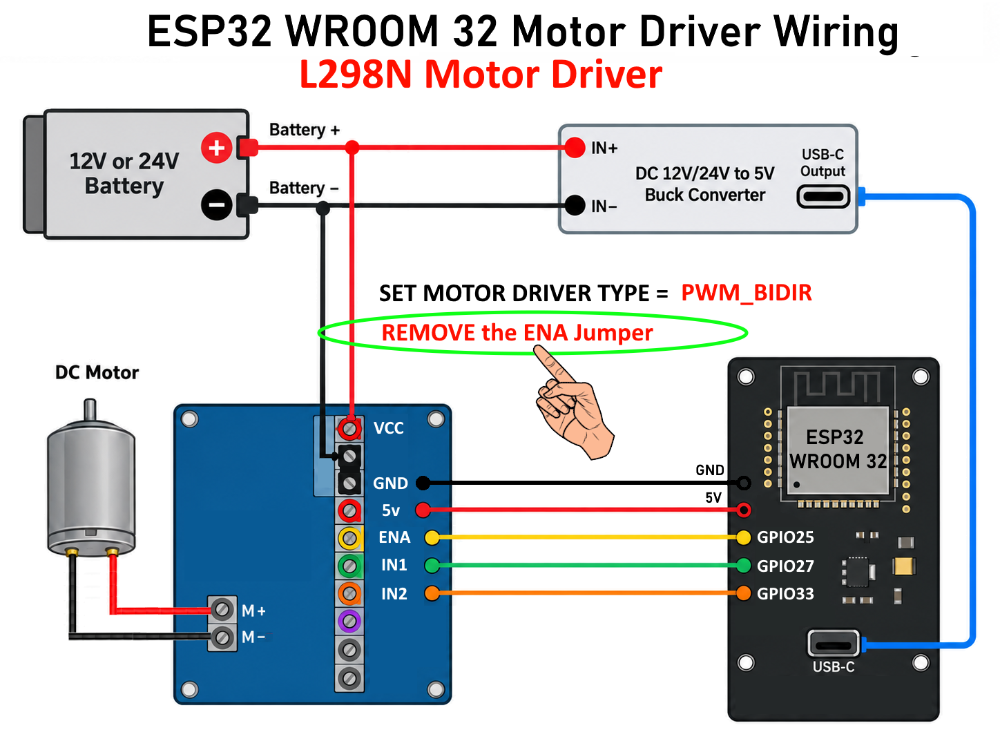
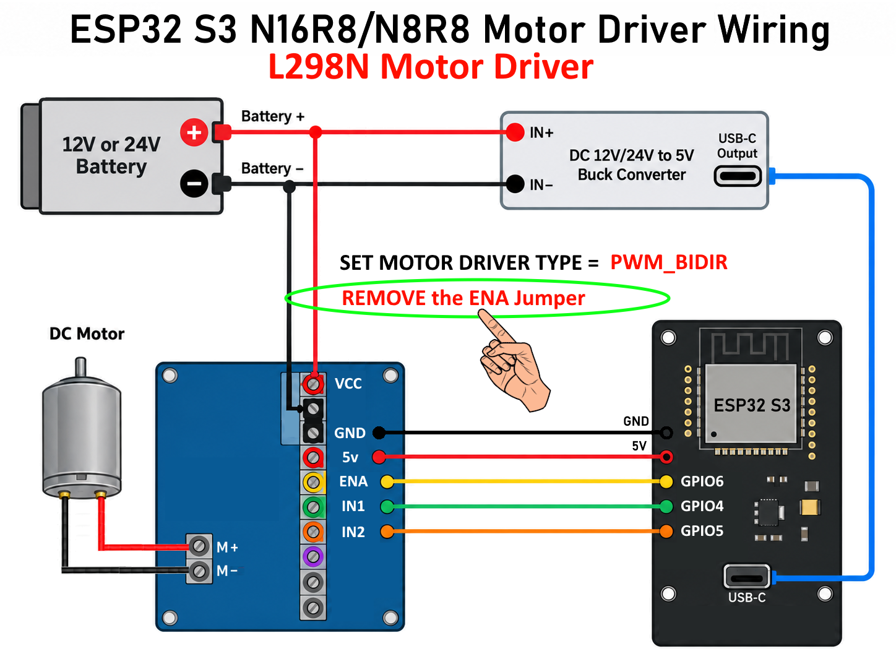

# PMT L298N Motor Driver Installation Guide
## Classic ESP32 and ESP32-S3

**For PMT firmware 3.3.4**

> # ⚠️ REQUIRED — REMOVE THE ENA JUMPER
>
> **The L298N ENA jumper MUST be removed before using PMT with this wiring.**
>
> PMT drives the L298N `ENA` pin with PWM to control motor speed.  
> If the ENA jumper is left installed, PMT cannot control `ENA` correctly.
>
> **Also set the PMT motor-driver type to:**
>
> ```text
> CV1=PWM_BIDIR
> ```
>
> **The jumper to remove is specifically the jumper for `ENA`.**

## Bill of Materials

For the **ESP32-S3-N16R8/N8R8** L298N installation:

- **ESP32-S3-N16R8/N8R8**
- **L298N Motor Driver**
- **DC 12V/24V to 5V USB-C Buck Converter, 3A / 15W Type-C Output**
- **DC motor**
- **12V or 24V battery/source**, matching the motor and installation

## Companion Video

No L298N-specific companion video was supplied for this guide.

---

Use the wiring section for your ESP32 board.

---

# 1. Identify Your Board

There are two L298N wiring profiles.

| Board | ENA | IN1 | IN2 |
|---|---:|---:|---:|
| **Classic ESP32-WROOM-32 / WROOM-32E** | **GPIO25** | **GPIO27** | **GPIO33** |
| **ESP32-S3** | **GPIO6** | **GPIO4** | **GPIO5** |

Use the wiring for your board.

## REQUIRED before wiring

- **REMOVE the L298N ENA jumper**
- Set the PMT motor-driver type to:

```text
CV1=PWM_BIDIR
```

**Do not leave the ENA jumper installed.**

---

# 2. Power Connections — Read This First

Recommended converter: **DC 12V/24V to 5V USB-C Buck Converter, 3A / 15W**.

Use the converter only with a battery/source that is within the converter's stated input range.

The **battery is the main power source**.

The battery powers:

- the L298N through **VCC** and **GND**
- the **DC 12V/24V to 5V USB-C Buck Converter, 3A / 15W**

The buck converter powers the ESP32 through USB-C.

The ESP32 **5V pin** connects to the L298N **5V** terminal as shown in the supplied wiring diagrams.

## Power wiring

```text
Battery +
   ├──> L298N VCC
   └──> Buck converter IN+

Battery -
   ├──> L298N GND
   └──> Buck converter IN-

Buck converter USB-C cable
   └──> ESP32 USB-C port

ESP32 5V pin
   └──> L298N 5V

ESP32 GND
   └──> L298N GND
```

**Before connecting the ESP32, adjust and verify the 5V USB-C buck converter output is 5.0V.**

Use a multimeter to check the 5V USB-C buck converter output before plugging its USB connection into the ESP32.

**Never connect Battery + directly to the ESP32 USB/5V input.**

The motor receives power through the L298N motor output terminals, not through the ESP32.

---

# 3. Grounds MUST Be Common

**Battery -, L298N GND, buck converter IN-, and ESP32 GND MUST all share the same ground.**

Connect:

- **Battery -** → **L298N GND**
- **Battery -** → **buck converter IN-**
- **ESP32 GND** → **L298N GND**

```text
Battery -
   ├──> L298N GND
   └──> Buck converter IN-

ESP32 GND
   └──> L298N GND
```

**If these grounds are not common, the L298N may not respond correctly to the ESP32.**

---

# 4. Complete L298N Connections

| L298N | Classic ESP32 | ESP32-S3 |
|---|---|---|
| **VCC** | **Battery +** | **Battery +** |
| **GND** | **Battery - / Common ground** | **Battery - / Common ground** |
| **5V** | **5V pin on the ESP32** | **5V pin on the ESP32-S3** |
| **ENA** | **GPIO25** | **GPIO6** |
| **IN1** | **GPIO27** | **GPIO4** |
| **IN2** | **GPIO33** | **GPIO5** |
| **M+** | Motor wire 1 | Motor wire 1 |
| **M-** | Motor wire 2 | Motor wire 2 |

> # ⚠️ ENA JUMPER MUST BE REMOVED
>
> **Remove the jumper connected to `ENA` before operating the motor.**
>
> PMT uses `ENA` as the PWM speed-control input. Leaving the ENA jumper installed prevents PMT from controlling that input correctly.

**Do not connect the motor to the ESP32.**

**Do not run motor current through an ESP32 pin, USB cable, or breadboard.**

Use the L298N motor and power terminals for the battery and motor-current wiring.

---

# 5. Classic ESP32

## ESP32 to L298N

| L298N | Classic ESP32 |
|---|---:|
| **ENA** | **GPIO25** |
| **IN1** | **GPIO27** |
| **IN2** | **GPIO33** |
| **5V** | **5V pin** |
| **GND** | **Common ground** |

## Classic Wiring Diagram



## Classic quick check

- [ ] **ENA JUMPER REMOVED**
- [ ] **PMT motor-driver type set to `PWM_BIDIR`**
- [ ] ENA -> GPIO25
- [ ] IN1 -> GPIO27
- [ ] IN2 -> GPIO33
- [ ] 5V -> ESP32 5V pin
- [ ] GND -> common ground
- [ ] VCC -> Battery +
- [ ] Motor -> M+ and M-
- [ ] Buck converter IN+ -> Battery +
- [ ] Buck converter IN- -> Battery -
- [ ] ESP32 powered from the 5V USB-C buck converter
- [ ] ESP32 GND -> L298N GND
- [ ] **Battery -, L298N GND, buck converter IN-, and ESP32 GND are common**
- [ ] **ENA jumper is NOT installed**

---

# 6. ESP32-S3

## ESP32-S3 to L298N

| L298N | ESP32-S3 |
|---|---:|
| **ENA** | **GPIO6** |
| **IN1** | **GPIO4** |
| **IN2** | **GPIO5** |
| **5V** | **5V pin** |
| **GND** | **Common ground** |

## ESP32-S3 Wiring Diagram



## ESP32-S3 quick check

- [ ] **ENA JUMPER REMOVED**
- [ ] **PMT motor-driver type set to `PWM_BIDIR`**
- [ ] ENA -> GPIO6
- [ ] IN1 -> GPIO4
- [ ] IN2 -> GPIO5
- [ ] 5V -> ESP32-S3 5V pin
- [ ] GND -> common ground
- [ ] VCC -> Battery +
- [ ] Motor -> M+ and M-
- [ ] Buck converter IN+ -> Battery +
- [ ] Buck converter IN- -> Battery -
- [ ] ESP32-S3 powered from the 5V USB-C buck converter
- [ ] ESP32-S3 GND -> L298N GND
- [ ] **Battery -, L298N GND, buck converter IN-, and ESP32-S3 GND are common**
- [ ] **ENA jumper is NOT installed**

---

# 7. Recommended Wiring Order

1. Disconnect the battery.
2. **REMOVE THE L298N ENA JUMPER.**
3. Confirm the jumper removed is the jumper associated with **ENA**.
4. Connect Battery - to the common-ground wiring.
5. Connect Battery + and Battery - to the 5V USB-C buck converter input.
6. Adjust the 5V USB-C buck converter to **5.0V** and verify it with a multimeter.
7. Disconnect the battery again.
8. Connect the L298N **5V** terminal to the **5V pin on the ESP32**.
9. Connect L298N GND to ESP32 GND/common ground.
10. Connect ENA, IN1, and IN2 using the table for your ESP32.
11. Connect the motor to L298N M+ and M-.
12. Connect Battery + to L298N VCC.
13. Connect Battery - to L298N GND.
14. Connect the 5V USB-C buck converter to the ESP32 through USB.
15. Set the PMT motor-driver type:

```text
CV1=PWM_BIDIR
```

16. Recheck all common-ground connections.
17. **Recheck that the ENA jumper is removed.**
18. Reconnect the battery.
19. Test the motor at a low throttle setting first.

---

# 8. First Motor Test

PMT must use the L298N-compatible **PWM_BIDIR** motor-driver mode for this wiring.

Set:

```text
CV1=PWM_BIDIR
```

For a normal installation using the default pins above, no motor-driver GPIO changes are required after selecting `PWM_BIDIR`.

Before applying throttle, verify again:

- **ENA jumper is removed**
- ENA is connected to the correct ESP32 GPIO
- IN1 and IN2 are connected to the correct ESP32 GPIOs
- grounds are common

Start with a low throttle setting.

Check:

- motor stops when commanded to stop
- motor runs smoothly
- forward and reverse both work
- ESP32 does not reset when the motor starts
- L298N and wiring do not become unusually hot

---

# 9. Motor Runs the Wrong Direction

If Forward and Reverse are opposite of what you want, use the PMT direction-invert setting:

```text
CV5=1
```

To return to normal direction:

```text
CV5=0
```

You do not need to rewire IN1 and IN2 just to reverse the normal direction.

---

# 10. Troubleshooting

## Motor does not run

Check:

1. **The ENA jumper has been REMOVED.**
2. PMT is set to:

```text
CV1=PWM_BIDIR
```

3. Battery + is connected to L298N VCC.
4. Battery - is connected to L298N GND.
5. L298N 5V is connected to the ESP32 5V pin.
6. L298N GND is connected to common ground.
7. ENA, IN1, and IN2 match your board table.
8. Motor is connected to M+ and M-.
9. Battery -, L298N, 5V USB-C buck converter, and ESP32 grounds are common.

## Motor runs at full speed or does not respond correctly to throttle

**Check the ENA jumper first.**

The **ENA jumper MUST be removed** so PMT can drive ENA with PWM.

Also check:

- ENA is connected to GPIO25 on a Classic ESP32 or GPIO6 on an ESP32-S3
- PMT is set to `PWM_BIDIR`
- ENA is not accidentally connected to IN1 or IN2

## Motor only runs in one direction

Check:

- IN1 wire
- IN2 wire
- correct GPIO table for your ESP32 board
- PMT is set to `PWM_BIDIR`

## Motor direction is backwards

Use:

```text
CV5=1
```

## ESP32 resets when the motor starts

Check:

1. Buck converter output remains close to 5V when the motor starts.
2. Battery -, buck converter IN-, L298N ground, and ESP32 ground are common.
3. Motor power is connected through the L298N, not through the ESP32.
4. Motor-current wiring is secure.
5. The 5V USB-C buck converter is suitable for powering the ESP32.

## L298N does not respond even though the ESP32 is running

**Check the common ground first.**

The ESP32 control signals cannot reliably control the L298N unless their grounds share the same reference.

Then verify:

- **ENA jumper is removed**
- `CV1=PWM_BIDIR`
- ENA, IN1, and IN2 are on the correct GPIOs

---

# 11. Advanced Configuration
## Only use this section if you intentionally changed the default control pins

The normal L298N installation uses the defaults above.

PMT uses these three `PWM_BIDIR` control CVs:

## Classic ESP32

| CV | L298N | Default GPIO |
|---:|---|---:|
| CV106 | ENA / PWM | GPIO25 |
| CV107 | IN1 / Forward | GPIO27 |
| CV108 | IN2 / Reverse | GPIO33 |

## ESP32-S3

| CV | L298N | Default GPIO |
|---:|---|---:|
| CV106 | ENA / PWM | GPIO6 |
| CV107 | IN1 / Forward | GPIO4 |
| CV108 | IN2 / Reverse | GPIO5 |

The motor-driver type must be:

```text
CV1=PWM_BIDIR
```

Only change CV106 through CV108 if you physically wired the L298N to different GPIOs.

> **Important:** Regardless of which GPIOs you use, the **ENA jumper must remain removed** because PMT must control ENA directly.

---

# 12. One-Page Wiring Reference

## REQUIRED

```text
REMOVE THE L298N ENA JUMPER

SET:
CV1=PWM_BIDIR
```

## Power

```text
Battery + ------+------> L298N VCC
                |
                +------> Buck converter IN+

Battery - ------+------> L298N GND
                |
                +------> Buck converter IN-

Buck USB-C cable ------> ESP32 USB-C port

ESP32 5V pin ----------> L298N 5V
ESP32 GND -------------> L298N GND

L298N M+ --------------> Motor
L298N M- --------------> Motor
```

**COMMON GROUND REQUIRED: Battery -, L298N GND, buck converter IN-, and ESP32 GND must share the same ground.**

## Classic ESP32

```text
ENA -> GPIO25
IN1 -> GPIO27
IN2 -> GPIO33
```

## ESP32-S3

```text
ENA -> GPIO6
IN1 -> GPIO4
IN2 -> GPIO5
```

> # ⚠️ FINAL CHECK
>
> **DO NOT OPERATE UNTIL THE ENA JUMPER HAS BEEN REMOVED.**
>
> PMT controls motor speed by applying PWM to `ENA`.
