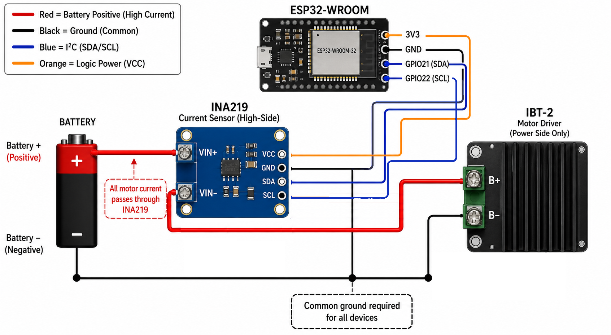

# INA219 Wiring & Configuration (ESP32 Throttle)

## Overview

The INA219 is a current and voltage sensor used to monitor:

- Battery voltage
- Current draw
- Power usage

This enables:

- Low voltage warnings
- Automatic throttle limiting
- Battery protection and shutdown

The INA219 communicates with the ESP32 using I²C.

---

# Wiring

## Default ESP32 → INA219 Connections

| Function | ESP32 Pin | INA219 Pin |
|----------|-----------|------------|
| SDA | GPIO 21 | SDA |
| SCL | GPIO 22 | SCL |
| Power | 3.3V preferred | VCC |
| Ground | GND | GND |

Use 3.3V for VCC when possible with an ESP32. Many INA219 modules also work from 5V, but 3.3V keeps the I²C pullups safer for ESP32 logic.

All devices must share the same GND.

---

# Power Path Wiring

The INA219 is installed in series with the battery positive line.

```text
Battery +  →  INA219 VIN+
INA219 VIN- →  Motor Driver POWER INPUT (+)
````

Ground wiring:

```text
Battery -  →  Motor Driver POWER INPUT (-)
            →  ESP32 GND
            →  INA219 GND
```

## Full System Diagram

```text
                +----------------------+
                |       INA219         |
                |                      |
Battery + ------> VIN+        VIN- ----+----> Motor Driver POWER INPUT (+)
                |                      |
ESP32 3.3V -----> VCC                  |
ESP32 GND ------> GND ----------------+----> Common GND
                |                      |
ESP32 GPIO21 ---> SDA                  |
ESP32 GPIO22 ---> SCL                  |
                +----------------------+

Battery - ---------------------------------> Motor Driver POWER INPUT (-)
                                            ESP32 GND
                                            INA219 GND
```

## Important Clarification

Connect INA219 VIN- to the motor driver power input positive terminal.

Correct motor driver power input labels may include:

* B+ / B-
* VIN / GND
* V+ / GND
* VM / GND

Do not connect the INA219 to motor output terminals such as:

* M+ / M-
* OUT1 / OUT2

## Key Rules

* INA219 goes in the positive battery line only.
* Ground is not interrupted.
* All grounds must be connected together.
* The INA219 module must be rated for the expected motor current.

---

# INA219 Pin Reference

| Pin  | Description                     |
| ---- | ------------------------------- |
| VCC  | Power for the INA219 module     |
| GND  | Ground                          |
| SDA  | I²C data                        |
| SCL  | I²C clock                       |
| VIN+ | Battery/source side positive    |
| VIN- | Load/motor-driver side positive |

---

# Configuration

Settings are available in:

* App UI → Battery Management
* CV commands

---

# Battery Management Settings

Voltage values are in millivolts.

Example:

```text
12000 = 12.0V
```

| CV | Setting             | Default | What It Does                                   | If Set to 0                                                        |
| -- | ------------------- | ------- | ---------------------------------------------- | ------------------------------------------------------------------ |
| 30 | Enable INA219       | 0       | Turns INA219 monitoring on/off                 | No readings, warnings, limiting, shutdown, or disconnect detection |
| 31 | SDA Pin             | 21      | Sets I²C data pin                              | If incorrect, INA219 will not communicate                          |
| 32 | SCL Pin             | 22      | Sets I²C clock pin                             | If incorrect, INA219 will not communicate                          |
| 33 | I²C Address         | 64      | Selects INA219 address                         | Address 0 is invalid; wrong address makes sensor appear missing    |
| 36 | Warn Voltage        | 0       | Shows low voltage warning                      | No early warning                                                   |
| 37 | Limit Voltage       | 0       | Reduces throttle when voltage is low           | No automatic throttle reduction                                    |
| 38 | Shutdown Voltage    | 0       | Stops motor to protect battery                 | No low-voltage shutdown                                            |
| 40 | Disconnect Voltage  | 0       | Detects battery disconnect or voltage collapse | No disconnect detection                                            |
| 41 | Throttle Cap (%)    | 25      | Max throttle allowed during voltage limiting   | 0 means no movement when limiting is active                        |
| 42 | Low Voltage LED Pin | 0       | Optional physical low-voltage LED output       | No physical LED; app can still show status                         |

Do not set CV42 to GPIO2. GPIO2 is already used as the controller status LED.

---

## CV33 — I²C Address

Default: 64, also written as 0x40.

Change CV33 only if:

* Multiple INA219 sensors are installed
* Another I²C device uses the same address
* The INA219 hardware address has been changed

CV33 must match the hardware address on the INA219 board.

See Appendix A.

---

# Advanced Settings

These are only available from the terminal or Direct CV editor.

| CV | Setting          | Default  | Description                                |
| -- | ---------------- | -------- | ------------------------------------------ |
| 34 | Sample Interval  | 500 ms   | How often measurements are taken           |
| 35 | Publish Interval | 10000 ms | How often telemetry is sent                |
| 39 | Recovery Voltage | 0 mV     | Voltage required to recover after shutdown |

If CV39 is 0, recovery voltage behavior is disabled or not used.

---

# Changing SDA / SCL Pins

Use:

* CV31 for SDA
* CV32 for SCL

The values must match the physical wiring.

Avoid pins already used by:

* Motor driver PWM
* Motor direction pins
* Status LED GPIO2
* Other accessories

---

# Troubleshooting

1. Check VCC and GND.
2. Verify SDA and SCL are not swapped.
3. Confirm CV31 and CV32 match the wiring.
4. Confirm CV33 matches the INA219 address.
5. Confirm all grounds are connected.
6. Confirm the INA219 is enabled with CV30 = 1.

---

# Safety Notes

* Double-check polarity before powering on.
* Do not short VIN+ to VIN-.
* Use wire sized for motor current.
* Use a fuse where practical.
* Do not exceed the current rating of the INA219 module.
* Li-ion/Li-Po batteries can be damaged by over-discharge and should use proper protection/BMS.

---

# Appendix A — Changing INA219 I²C Address

## Pad Layout

Many INA219 boards have A0 and A1 solder jumpers.

```text
[A0]   [A1]

 o o     o o
```

## How It Works

* Open pads = GND
* Bridged pads = VCC

## Address Table

| A1  | A0  | Address | Decimal |
| --- | --- | ------- | ------- |
| GND | GND | 0x40    | 64      |
| GND | VCC | 0x41    | 65      |
| VCC | GND | 0x44    | 68      |
| VCC | VCC | 0x45    | 69      |

## How to Change

Leave pads open for the default address.

Bridge both pads for A0 or A1 with a small amount of solder to change the address.

Example:

```text
A0: o=o
A1: o o
```

This gives address 0x41, so set:

```text
CV33 = 65
```

## Checklist

* Set A0/A1 pads.
* Update CV33.
* Power cycle.
* Test sensor readings.


